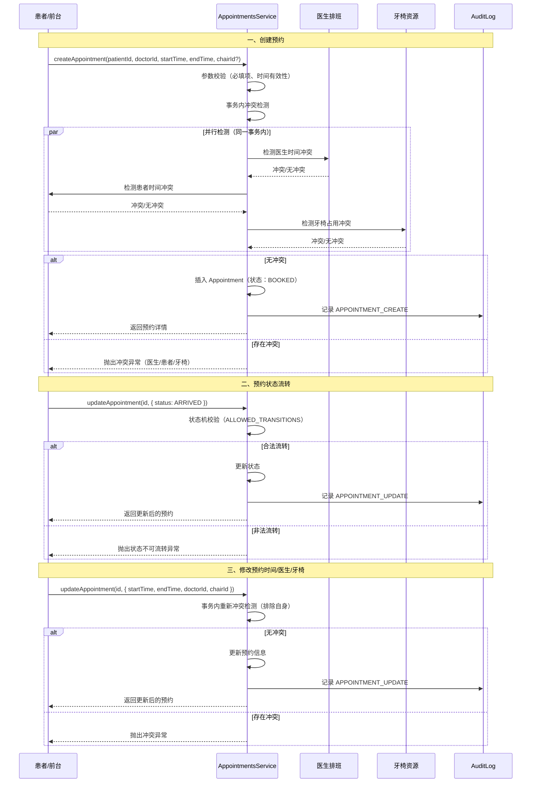

# 预约流程文档

## 概述

预约系统是口腔诊所管理系统的前台调度核心，负责管理患者就诊预约的全生命周期。系统通过事务保证并发安全，支持医生、患者、牙椅三维冲突检测，并提供完整的状态机管理。

## 流程图



## 一、预约状态机

### 1.1 状态定义

| 状态 | 说明 |
|------|------|
| BOOKED | 已预约 |
| ARRIVED | 患者已到店 |
| IN_CHAIR | 治疗中（已上椅） |
| COMPLETED | 已完成 |
| CANCELLED | 已取消 |
| NO_SHOW | 爽约（未到店） |

### 1.2 状态转换规则

```
BOOKED   → ARRIVED / CANCELLED / NO_SHOW
ARRIVED  → IN_CHAIR / CANCELLED / NO_SHOW
IN_CHAIR → COMPLETED / CANCELLED
COMPLETED → （终态，不可转换）
CANCELLED → （终态，不可转换）
NO_SHOW   → （终态，不可转换）
```

### 1.3 状态机校验

所有状态变更均通过 `ALLOWED_TRANSITIONS` 校验，非法转换抛出 `BadRequestException`。

位置：`src/modules/scheduling/appointments/appointments.service.ts:110-117`

## 二、预约创建流程

### 2.1 前置条件
- 患者已建档
- 医生已排班（时间可用）
- 牙椅可用（如指定）

### 2.2 必填参数
| 参数 | 说明 | 必填 |
|------|------|------|
| patientId | 患者 ID | 是 |
| doctorId | 医生 ID | 是 |
| startTime | 开始时间 | 是 |
| endTime | 结束时间 | 是 |
| type | 预约类型 | 是 |
| chairId | 牙椅 ID | 否 |
| remark | 备注 | 否 |

### 2.3 时间校验
- 结束时间必须晚于开始时间
- 时间格式：ISO 8601 字符串

### 2.4 冲突检测（事务内）

创建和修改预约时，在同一事务内执行三维冲突检测：

#### 2.4.1 医生冲突
```sql
SELECT id FROM Appointment 
WHERE doctorId = ? 
  AND status IN ('BOOKED', 'ARRIVED', 'IN_CHAIR')
  AND startTime < ? 
  AND endTime > ?
```

重叠判断：`新预约.startTime < 已有预约.endTime AND 新预约.endTime > 已有预约.startTime`

#### 2.4.2 患者冲突
同一患者不能在同一时间段有多个有效预约。

#### 2.4.3 牙椅冲突
同一牙椅不能在同一时间段被多个预约占用（仅当指定 chairId 时检测）。

### 2.5 事务保证
- 冲突检测 + 插入在**同一事务**内执行，防止竞态条件
- 修改预约时，冲突检测排除自身（`id != ?`）

位置：`src/modules/scheduling/appointments/appointments.service.ts:60-107`

## 三、预约修改规则

### 3.1 可修改字段
| 字段 | 修改时是否需重新检测冲突 |
|------|--------------------------|
| status | 否（状态机校验） |
| type | 否 |
| remark | 否 |
| startTime | 是 |
| endTime | 是 |
| doctorId | 是 |
| chairId | 是 |

### 3.2 修改流程
1. 读取当前预约信息
2. 若状态变更：执行状态机校验
3. 若时间/医生/牙椅变更：事务内重新冲突检测（排除自身）
4. 执行更新
5. 写入审计日志 `APPOINTMENT_UPDATE`

## 四、爽约处理

### 4.1 爽约标记
- 状态：`NO_SHOW`
- 入口：`updateAppointment(id, { status: 'NO_SHOW' })`
- 前置状态：仅 `BOOKED` 或 `ARRIVED` 可标记为爽约

### 4.2 业务规则
- 爽约为终态，不可撤销
- 爽约预约不计入医生/牙椅占用（但保留记录）

## 五、预约与就诊关联

### 5.1 关联字段
- `Appointment.visitId`：关联的就诊记录 ID
- `Visit.appointmentId`：关联的预约 ID（唯一约束）

### 5.2 关联时机
挂号开始就诊时自动关联：
1. 若挂号关联预约且预约已有 Visit → 复用
2. 否则创建新 Visit
3. 双向回填 `visitId` 和 `appointmentId`

位置：`src/modules/clinical/registrations/registrations.service.ts:109-162`

## 六、相关数据库表

### 6.1 Appointment（预约）

| 字段 | 类型 | 说明 |
|------|------|------|
| id | TEXT | 主键 |
| patientId | TEXT | 患者 ID |
| doctorId | TEXT | 医生 ID |
| chairId | TEXT | 牙椅 ID |
| startTime | TEXT | 开始时间 |
| endTime | TEXT | 结束时间 |
| status | TEXT | 状态（BOOKED/ARRIVED/IN_CHAIR/COMPLETED/CANCELLED/NO_SHOW） |
| type | TEXT | 预约类型 |
| remark | TEXT | 备注 |
| visitId | TEXT | 关联就诊 ID |
| clinicId | TEXT | 诊所 ID |

### 6.2 Chair（牙椅）

| 字段 | 类型 | 说明 |
|------|------|------|
| id | TEXT | 主键 |
| name | TEXT | 牙椅名称 |
| location | TEXT | 位置 |
| active | INTEGER | 是否启用 |
| clinicId | TEXT | 诊所 ID |

## 七、异常处理

| 异常场景 | 错误信息 | 处理方式 |
|----------|----------|----------|
| 必填参数缺失 | 患者、医生、开始时间、结束时间和类型不能为空 | 前端校验 + 后端校验 |
| 时间无效 | 结束时间必须晚于开始时间 | 前端校验 + 后端校验 |
| 医生时间冲突 | 该时间段医生已有预约 | 提示更换医生或时间 |
| 患者时间冲突 | 该时间段患者已有其他预约 | 提示患者已有预约 |
| 牙椅占用冲突 | 该时间段牙椅已被占用 | 提示更换牙椅或时间 |
| 状态非法流转 | 预约状态不可从 X 流转到 Y | 阻止操作 |
| 并发修改冲突 | - | 事务保证，后提交者失败 |

## 八、查询支持

### 8.1 筛选条件
- `doctorId`：按医生筛选
- `patientId`：按患者筛选
- `status`：按状态筛选
- `startDate` / `endDate`：按日期范围筛选

### 8.2 排序
- 默认按 `startTime` 升序

### 8.3 分页
- 默认每页 50 条
- 最大不超过 `MAX_PAGE_SIZE`

位置：`src/modules/scheduling/appointments/appointments.service.ts:17-54`

## 九、架构设计要点

### 9.1 并发安全
- 冲突检测 + 写入在同一事务内，避免竞态条件
- SQLite 的事务隔离保证了并发创建预约的一致性

### 9.2 诊所隔离
所有预约数据通过 `clinicId` 字段实现多租户隔离。

### 9.3 软删除
预约采用软删除（`deletedAt`），保留历史数据用于审计和统计。
