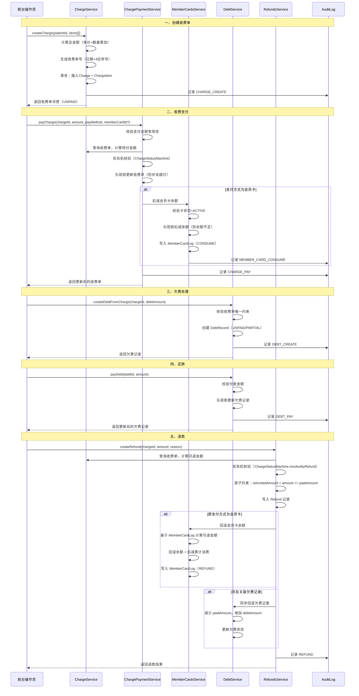

# 收费流程文档

## 概述

收费系统是口腔诊所管理系统的核心财务模块，负责管理患者就诊费用的收取、退款、欠费等全流程。系统采用事务保证数据一致性，支持多种支付方式，并提供完整的审计日志。

## 流程图



## 一、收费单创建流程

### 1.1 前置条件
- 患者已建档
- 收费项目（治疗项目/耗材）已确认

### 1.2 流程步骤
1. **参数校验**：校验患者 ID、收费明细等必填参数
2. **金额计算**：遍历收费明细，累加 `单价 × 数量` 得到总金额
3. **单号生成**：
   - 格式：`YYYYMMDD + 4位序号`（如 202607250001）
   - 采用"查询最新序号 + 1"方式，遇唯一约束冲突自动重试（最多 3 次）
4. **事务写入**：
   - 插入 `Charge` 主表（状态：UNPAID）
   - 批量插入 `ChargeItem` 明细表
   - 写入审计日志 `CHARGE_CREATE`

### 1.3 关键代码位置
- 主逻辑：`src/modules/financial/charge/charge.service.ts:64-151`
- 单号生成：`src/modules/financial/charge/charge.service.ts:153-174`

## 二、收费明细计算逻辑

### 2.1 金额字段说明
所有金额以**分**为单位存储（整数），对外展示时转换为元。

| 字段 | 说明 | 单位 |
|------|------|------|
| totalAmount | 收费总金额 | 分 |
| paidAmount | 已付金额 | 分 |
| refundedAmount | 已退金额 | 分 |
| discount | 优惠金额 | 分 |

### 2.2 计算规则
- 明细小计 = 单价 × 数量
- 总金额 = Σ 明细小计
- 待付金额 = 总金额 - 已付金额
- 可退金额 = 已付金额 - 已退金额

### 2.3 工具函数
- `yuanToCents(amount)`：元转分
- `centsToYuan(amount)`：分转元
- `centsGreaterThan(a, b)`：分比较（大于）
- `centsGreaterThanOrEqual(a, b)`：分比较（大于等于）

位置：`src/common/utils/format/money.utils.ts`

## 三、收费单状态机

### 3.1 状态定义
| 状态 | 说明 |
|------|------|
| UNPAID | 未支付 |
| PARTIAL | 部分支付 |
| PAID | 已结清 |
| REFUNDED | 已退款 |
| CANCELLED | 已作废 |

### 3.2 状态转换规则
```
UNPAID   → PARTIAL / PAID / CANCELLED
PARTIAL  → PAID / PARTIAL / CANCELLED
PAID     → REFUNDED / PAID
REFUNDED → REFUNDED
CANCELLED → CANCELLED
```

### 3.3 状态推导
- **根据支付金额推导**：`ChargeStatusMachine.resolveByPayment(paid, total)`
  - paid ≤ 0 → UNPAID
  - paid ≥ total → PAID
  - 0 < paid < total → PARTIAL
- **根据退款金额推导**：`ChargeStatusMachine.resolveByRefund(paid, refunded, currentStatus)`
  - refunded ≥ paid → REFUNDED
  - 否则保持当前状态

位置：`src/modules/financial/charge/domain/charge-status-machine.ts`

## 四、支付方式处理

### 4.1 支持的支付方式
支付方式通过 `payMethod` 字段传递，当前代码中主要处理：

| 支付方式 | 说明 | 额外参数 |
|----------|------|----------|
| CASH | 现金 | - |
| CARD | 刷卡 | - |
| MEMBER_CARD | 会员卡 | memberCardId（必填） |
| INSURANCE | 医保 | - |

### 4.2 会员卡支付流程
1. 校验会员卡存在且状态为 `ACTIVE`
2. 乐观锁扣减余额：`UPDATE MemberCard SET balance = balance - ? WHERE id = ? AND balance >= ?`
3. 增加累计消费：`totalConsume = totalConsume + amount`
4. 写入 `MemberCardLog`（type: CONSUME，amount 为负值）
5. 写入审计日志 `MEMBER_CARD_CONSUME`

### 4.3 并发控制
- 采用**乐观锁**防止并发支付超付
- SQL 条件：`WHERE (totalAmount - paidAmount) >= ?`
- 更新行数为 0 时抛出"并发冲突"异常

## 五、欠费管理

### 5.1 欠费创建
- 从收费单创建欠费记录：`createDebtFromCharge()`
- 同一收费单只能创建一条欠费记录（chargeId 唯一约束）
- 状态：
  - 完全未付 → UNPAID
  - 部分支付 → PARTIAL
  - 已结清 → PAID

### 5.2 欠费状态
| 状态 | 说明 |
|------|------|
| UNPAID | 未还款 |
| PARTIAL | 部分还款 |
| PAID | 已结清 |
| CANCELLED | 已取消 |

### 5.3 还款流程
1. 校验还款金额有效性
2. 查询欠费记录，计算剩余欠款
3. 乐观锁更新：`WHERE debtAmount >= ?`
4. 更新状态（PAID / PARTIAL）
5. 记录 `DEBT_PAY` 审计日志

位置：`src/modules/financial/charge/debt.service.ts`

## 六、退款流程

### 6.1 退款规则
- 可退金额 = 已付金额 - 已退金额
- 退款金额不能超过可退金额
- 采用乐观锁防并发退款：`WHERE refundedAmount + ? <= paidAmount`

### 6.2 退款副作用（同一事务内）
退款操作必须在同一事务内完成以下全部步骤：

1. **写入 Refund 记录**
2. **更新 Charge**：refundedAmount + amount，状态更新（REFUNDED 或保持）
3. **会员卡回滚**（若原支付为会员卡）：
   - 基于 `MemberCardLog` 精确计算该 charge 的可退金额
   - 可退金额 = 累计消费（绝对值）- 累计已退款
   - 实际退款 = min(本次退款, 可退金额)
   - 余额回退 + 累计消费扣减（不低于 0）
   - 写入 MemberCardLog（REFUND）
4. **欠费同步**（若存在关联 DebtRecord）：
   - 减少 paidAmount（不低于 0）
   - 增加 debtAmount
   - 更新欠费状态
5. **写入审计日志**：REFUND

### 6.3 幂等性保证
传入 `requestId` 时启用幂等性，基于 `IdempotencyService` 实现。

位置：`src/modules/financial/refunds/refunds.service.ts`

## 七、审计日志

所有财务操作均记录审计日志，主要类型：

| 日志类型 | 触发时机 | 表 |
|----------|----------|-----|
| CHARGE_CREATE | 创建收费单 | Charge |
| CHARGE_PAY | 收费支付 | Charge |
| DEBT_CREATE | 创建欠费 | DebtRecord |
| DEBT_PAY | 欠费还款 | DebtRecord |
| REFUND | 退款 | Charge |
| MEMBER_CARD_RECHARGE | 会员卡充值 | MemberCard |
| MEMBER_CARD_CONSUME | 会员卡消费 | MemberCard |
| MEMBER_CARD_REFUND | 会员卡退款 | MemberCard |

审计日志表字段：
- `beforeData`：操作前数据快照（JSON）
- `afterData`：操作后数据快照（JSON）
- `operatorId` / `operatorName`：操作人
- `ip` / `userAgent` / `source`：操作来源

## 八、相关数据库表

### 8.1 Charge（收费单）
| 字段 | 类型 | 说明 |
|------|------|------|
| id | TEXT | 主键 |
| patientId | TEXT | 患者 ID |
| visitId | TEXT | 就诊 ID |
| doctorId | TEXT | 医生 ID |
| number | TEXT | 收费单号（唯一） |
| totalAmount | INTEGER | 总金额（分） |
| paidAmount | INTEGER | 已付金额（分） |
| refundedAmount | INTEGER | 已退金额（分） |
| discount | INTEGER | 优惠金额（分） |
| status | TEXT | 状态 |
| payMethod | TEXT | 支付方式 |
| paidAt | TEXT | 支付时间 |
| clinicId | TEXT | 诊所 ID |

### 8.2 ChargeItem（收费明细）
| 字段 | 类型 | 说明 |
|------|------|------|
| id | TEXT | 主键 |
| chargeId | TEXT | 收费单 ID |
| name | TEXT | 项目名称 |
| category | TEXT | 项目类别 |
| price | INTEGER | 单价（分） |
| quantity | INTEGER | 数量 |
| subtotal | INTEGER | 小计（分） |
| teethNumbers | TEXT | 涉及牙位（JSON） |

### 8.3 DebtRecord（欠费记录）
| 字段 | 类型 | 说明 |
|------|------|------|
| id | TEXT | 主键 |
| chargeId | TEXT | 收费单 ID（唯一） |
| patientId | TEXT | 患者 ID |
| totalAmount | INTEGER | 总金额（分） |
| paidAmount | INTEGER | 已还金额（分） |
| debtAmount | INTEGER | 欠款金额（分） |
| status | TEXT | 状态 |
| lastPaymentAt | TEXT | 最后还款时间 |

### 8.4 Refund（退款记录）
| 字段 | 类型 | 说明 |
|------|------|------|
| id | TEXT | 主键 |
| chargeId | TEXT | 收费单 ID |
| patientId | TEXT | 患者 ID |
| amount | INTEGER | 退款金额（分） |
| reason | TEXT | 退款原因 |
| operatorId | TEXT | 操作人 ID |
| operatorName | TEXT | 操作人姓名 |

### 8.5 MemberCard / MemberCardLog
参见 [会员卡流程文档](./member-card-flow.md)

## 九、异常处理

| 异常场景 | 错误信息 | 处理方式 |
|----------|----------|----------|
| 支付金额无效 | 支付金额必须为有效正数 | 前端校验 + 后端校验 |
| 收费已结清 | 该收费已结清 | 阻止支付 |
| 支付超额 | 支付金额不能超过待付金额 X.XX | 阻止支付 |
| 会员卡不存在 | 会员卡不存在 | 阻止支付 |
| 会员卡状态异常 | 会员卡状态异常，无法消费 | 阻止支付 |
| 余额不足 | 会员卡余额不足 | 阻止支付 |
| 并发冲突 | 支付失败：并发冲突，请刷新后重试 | 提示用户刷新后重试 |
| 可退金额为零 | 该收费无可退金额 | 阻止退款 |
| 退款超额 | 退款金额不能超过可退金额 X.XX | 阻止退款 |
| 欠费重复创建 | 该收费单已存在欠费记录 | 阻止创建 |
| 单号冲突 | - | 自动重试（最多 3 次） |

## 十、架构设计要点

### 10.1 事务一致性
所有涉及金额变更的操作均在数据库事务内执行，确保：
- 收费单状态与金额一致
- 会员卡余额与流水一致
- 欠费记录与收费单一致
- 审计日志与业务操作一致

### 10.2 幂等性
关键支付/退款操作支持 `requestId` 幂等参数，基于 `IdempotencyService` 实现。
详见 ADR-0005：`docs/adr/0005-idempotency-service-single-instance.md`

### 10.3 诊所隔离
所有财务数据通过 `clinicId` 字段实现多租户隔离，基于 `ClinicContextService` 注入。
详见 ADR-0002：`docs/adr/0002-clinic-isolation-via-context.md`
