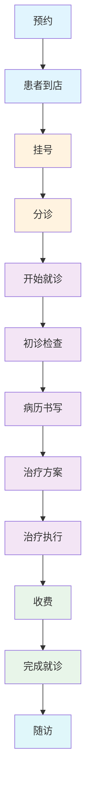

# 就诊流程文档

## 概述

就诊流程是口腔诊所管理系统的核心业务主线，贯穿患者从预约到完成治疗的全过程。系统采用状态机管理各环节状态，通过事务保证数据一致性，并支持病历锁定与修改审批机制。

## 完整就诊流程图



## 一、预约环节

### 1.1 预约创建
- 患者通过电话/微信/到店预约
- 前台录入患者信息、医生、时间、牙椅
- 系统自动检测医生、患者、牙椅时间冲突
- 预约状态：`BOOKED`

### 1.2 预约到店
- 患者到店后，前台将预约状态改为 `ARRIVED`
- 可选：直接挂号

详见 [预约流程文档](./appointment-flow.md)

## 二、挂号环节

### 2.1 挂号状态机

| 状态 | 说明 |
|------|------|
| REGISTERED | 已挂号 |
| TRIAGED | 已分诊 |
| IN_PROGRESS | 就诊中 |
| COMPLETED | 已完成 |
| CANCELLED | 已取消 |

状态转换规则：
```
REGISTERED → TRIAGED / IN_PROGRESS / CANCELLED
TRIAGED    → IN_PROGRESS / CANCELLED
IN_PROGRESS → COMPLETED / CANCELLED
COMPLETED  → （终态）
CANCELLED  → （终态）
```

### 2.2 挂号创建
- 关联患者、医生、预约（可选）
- 记录主诉（chiefComplaint）
- 挂号状态：`REGISTERED`

### 2.3 分诊
- 护士分诊，记录分诊意见（triageNote）
- 更新主诉
- 状态流转：`REGISTERED → TRIAGED`

位置：`src/modules/clinical/registrations/registrations.service.ts:203-209`

### 2.4 开始就诊（核心）

开始就诊是连接挂号与就诊的关键节点，在同一事务内完成：

1. **状态机校验**：仅 `REGISTERED` 或 `TRIAGED` 可开始
2. **创建/复用 Visit**：
   - 若挂号关联预约且预约已有 Visit → 复用
   - 否则创建新 Visit（状态：IN_PROGRESS）
3. **回填关联**：
   - `Registration.visitId` = Visit ID
   - `Registration.status` = `IN_PROGRESS`
   - 若有预约：`Appointment.visitId` = Visit ID
4. **幂等保证**：若 visitId 已存在，直接返回

位置：`src/modules/clinical/registrations/registrations.service.ts:109-162`

## 三、就诊环节

### 3.1 就诊（Visit）状态机

| 状态 | 说明 |
|------|------|
| IN_PROGRESS | 就诊中 |
| COMPLETED | 已完成 |
| CANCELLED | 已取消 |

状态转换规则：
```
IN_PROGRESS → COMPLETED / CANCELLED
COMPLETED   → （终态）
CANCELLED   → （终态）
```

位置：`src/modules/clinical/visits/visits.service.ts:63-67`

### 3.2 初诊检查（FirstExam）

初诊是新患者首次就诊的全面检查环节：

- **初诊状态**：DRAFT → SUBMITTED → APPROVED / CANCELLED
- **初诊内容**：
  - 牙列类型（恒牙/乳牙）
  - 主诉
  - 诊断
  - 治疗建议
  - 逐牙检查记录（FirstExamTooth）
- **初诊重启**：支持初诊重启（isRestart = 1），关联 parentExamId
- **初诊跟踪**：FirstExamTrack 记录初诊跟进状态、主任建议、流失原因等

位置：
- 表定义：`src/db/schema/clinical.tables.ts:240-302`

### 3.3 病历（MedicalRecord）

#### 3.3.1 病历内容
- 主诉（chiefComplaint）
- 现病史（presentIllness）
- 既往史（pastHistory）
- 过敏史（allergyHistory）
- 检查（examination）
- 诊断（diagnosis）
- 治疗计划（treatmentPlan）
- 涉及牙位（teethInvolved）
- 影像资料（images）

#### 3.3.2 病历锁定机制

病历完成后可锁定，锁定后无法直接修改：

**锁定流程**：
1. 医生确认病历无误后点击锁定
2. 状态：`isLocked = 1`
3. 记录锁定人、锁定时间
4. 并发控制：`WHERE isLocked = 0`，防止重复锁定

**修改流程**：
1. 锁定后如需修改，提交修改申请（RecordModifyRequest）
2. 申请状态：`PENDING`
3. 审批人审批：
   - 通过（APPROVED）→ 病历解锁（isLocked = 0），医生可修改
   - 驳回（REJECTED）→ 病历保持锁定
4. 审批并发控制：`WHERE status = 'PENDING'`，防止重复审批

位置：
- 锁定：`src/modules/clinical/medical-records/medical-records.service.ts:238-262`
- 修改申请审批：`src/modules/clinical/medical-records/medical-records.service.ts:108-141`

#### 3.3.3 病历模板与短语
- **病历模板**（MedicalRecordTemplate）：预定义常用病历结构
- **病历短语**（MedicalRecordPhrase）：常用医学短语，快速录入
- 支持按分类管理

### 3.4 口腔检查（OralExamination / PeriodontalRecord）

- **口腔检查**：菌斑指数、牙石指数、出血指数、龋坏、松动、叩痛、牙髓活力、黏膜、颞下颌关节等
- **牙周记录**：详细牙周检查数据（JSON 格式存储）

位置：`src/db/schema/clinical.tables.ts:132-171`

### 3.5 治疗计划（TreatmentPlan）

- 治疗计划状态：DRAFT → APPROVED → IN_PROGRESS → COMPLETED / CANCELLED
- 治疗计划明细（TreatmentPlanItem）：
  - 项目代码、名称、分类、价格、数量
  - 涉及牙位
  - 状态：PLANNED / 其他
  - 关联的治疗记录（treatmentId）

位置：`src/db/schema/clinical.tables.ts:96-131`

### 3.6 治疗执行（Treatment）

- 治疗记录状态：PLANNED → IN_PROGRESS → COMPLETED / CANCELLED
- 关联就诊（visitId）和医生（doctorId）
- 记录治疗项目、牙位、价格、数量
- 可关联到收费单和库存扣减

位置：`src/db/schema/clinical.tables.ts:63-85`

## 四、收费环节

治疗完成后进行收费，详见 [收费流程文档](./charge-flow.md)：

1. 创建收费单（关联患者、就诊、医生）
2. 添加收费项目（治疗费、耗材费等）
3. 收费支付（现金/刷卡/会员卡/医保）
4. 如部分支付，生成欠费记录
5. 库存耗材自动扣减（如有）

## 五、完成就诊

### 5.1 就诊完成
- 操作：`VisitsService.complete(id, { diagnosis?, remark? })`
- 状态流转：`IN_PROGRESS → COMPLETED`
- 记录诊断、结束时间
- 前置校验：仅 `IN_PROGRESS` 状态可完成

位置：`src/modules/clinical/visits/visits.service.ts:69-89`

### 5.2 挂号完成
- 操作：`RegistrationsService.complete(id)`
- 状态流转：`IN_PROGRESS → COMPLETED`
- 前置校验：仅 `IN_PROGRESS` 可完成

位置：`src/modules/clinical/registrations/registrations.service.ts:167-171`

## 六、随访环节

治疗完成后可安排随访：
- 随访计划（FollowUp）：计划日期、内容、负责人
- 随访记录：实际随访情况、患者反馈

位置：`src/modules/communication/follow-ups/`

## 七、各环节数据流转

### 7.1 数据关联图

```
Appointment
    ↓ (visitId)
Registration → Visit
                  ↓
        ┌─────────┼─────────┐
        ↓         ↓         ↓
   FirstExam  MedicalRecord  Treatment
        ↓         ↓         ↓
   FirstExamTooth  ...    TreatmentPlan
                                  ↓
                            TreatmentPlanItem
                                  ↓
                              Charge → ChargeItem
                                  ↓
                          InventoryTransaction (耗材扣减)
```

### 7.2 关键字段关联

| 来源表 | 关联字段 | 目标表 | 说明 |
|--------|----------|--------|------|
| Appointment | visitId | Visit | 预约关联就诊 |
| Registration | visitId | Visit | 挂号关联就诊 |
| Registration | appointmentId | Appointment | 挂号关联预约 |
| Visit | appointmentId | Appointment | 就诊关联预约（唯一） |
| MedicalRecord | visitId | Visit | 病历关联就诊 |
| MedicalRecord | patientId | Patient | 病历关联患者 |
| Treatment | visitId | Visit | 治疗关联就诊 |
| TreatmentPlan | visitId | Visit | 治疗计划关联就诊 |
| FirstExam | patientId | Patient | 初诊关联患者 |
| Charge | visitId | Visit | 收费关联就诊 |
| Charge | patientId | Patient | 收费关联患者 |
| ChargeItem | chargeId | Charge | 收费明细关联收费单 |

## 八、相关数据库表汇总

| 表名 | 说明 | 核心字段 |
|------|------|----------|
| Appointment | 预约 | patientId, doctorId, chairId, startTime, endTime, status, visitId |
| Registration | 挂号 | patientId, doctorId, status, visitId, appointmentId, chiefComplaint |
| Visit | 就诊 | patientId, doctorId, appointmentId, status, diagnosis, startTime, endTime |
| FirstExam | 初诊 | patientId, doctorId, status, chiefComplaint, diagnosis, isRestart, parentExamId |
| FirstExamTooth | 初诊牙位 | examId, toothNumber, toothStatus, diseases, treatmentPlan |
| MedicalRecord | 病历 | patientId, visitId, doctorId, chiefComplaint, diagnosis, isLocked, lockedBy |
| RecordModifyRequest | 病历修改申请 | recordId, applicantId, reason, status, reviewerId, reviewRemark |
| OralExamination | 口腔检查 | patientId, visitId, doctorId, plaqueIndex, caries, ... |
| PeriodontalRecord | 牙周记录 | patientId, visitId, doctorId, data (JSON) |
| TreatmentPlan | 治疗计划 | patientId, visitId, doctorId, status, totalFee |
| TreatmentPlanItem | 计划明细 | planId, code, name, price, quantity, status, treatmentId |
| Treatment | 治疗记录 | patientId, visitId, doctorId, code, name, price, quantity, status |
| Charge | 收费单 | patientId, visitId, doctorId, totalAmount, paidAmount, status |
| ChargeItem | 收费明细 | chargeId, name, category, price, quantity, subtotal |

## 九、异常处理

| 异常场景 | 错误信息 | 处理方式 |
|----------|----------|----------|
| 挂号状态非法流转 | 挂号状态不可从 X 流转到 Y | 阻止操作 |
| 就诊状态非法流转 | 就诊状态不可从 X 流转到 Y | 阻止操作 |
| 重复开始就诊 | （幂等处理，直接返回） | 自动幂等 |
| 病历已锁定 | 病历已锁定，无法直接修改 | 引导提交修改申请 |
| 病历重复锁定 | 病历已被其他用户锁定 | 提示刷新后重试 |
| 修改申请重复审批 | 该请求已被其他审批者处理 | 提示刷新后重试 |
| 就诊已完成/已取消 | 当前就诊状态为 X，仅 IN_PROGRESS 可完成就诊 | 阻止操作 |

## 十、架构设计要点

### 10.1 状态机驱动
每个业务环节都有明确的状态机定义和校验：
- 预约状态机
- 挂号状态机
- 就诊状态机
- 病历锁定机制
- 治疗/治疗计划状态机

状态机校验集中管理，非法状态转换直接抛出异常。

### 10.2 事务一致性
关键节点操作在事务内完成：
- 开始就诊：创建 Visit + 回填 Registration + 回填 Appointment
- 病历锁定/解锁：状态变更 + 审计日志
- 修改审批：申请状态更新 + 病历解锁

### 10.3 审计日志
所有重要操作均记录审计日志：
- 预约创建/修改/删除
- 挂号创建/开始就诊/取消
- 就诊创建/完成
- 病历更新/锁定/修改申请
- ...

### 10.4 诊所隔离
所有临床数据通过 `clinicId` 字段实现多租户隔离。

### 10.5 软删除
所有业务数据采用软删除（`deletedAt`），保留历史数据用于审计和统计。
