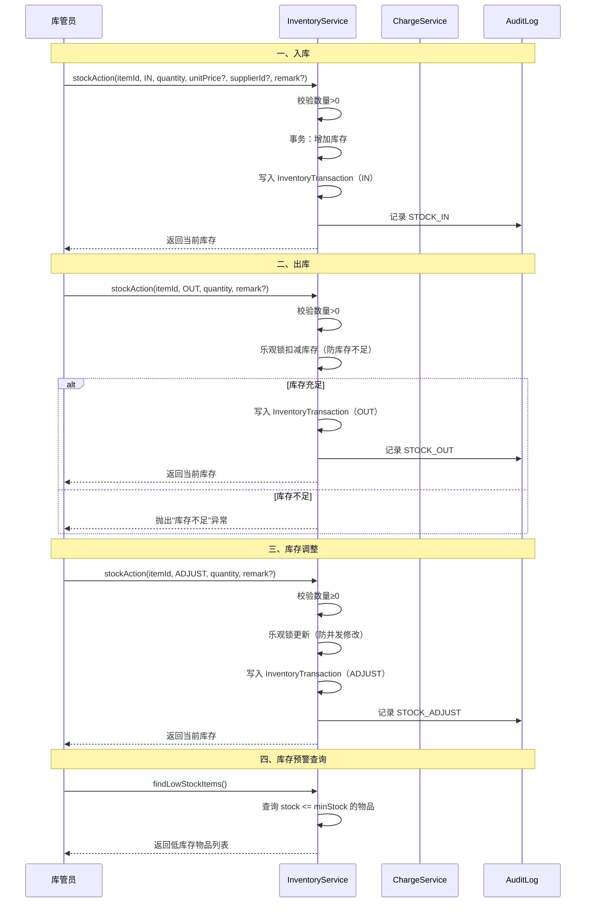

# 库存管理流程文档

## 概述

库存管理系统是口腔诊所管理系统的物资管理模块，负责管理耗材、药品等库存物资的入库、出库、调整全流程。系统采用事务保证数据一致性，所有库存变动必须留下流水记录，支持库存预警和幂等性操作。

## 流程图



## 一、库存操作类型

### 1.1 操作类型

| 类型 | 说明 | 数量方向 | 示例场景 |
|------|------|----------|----------|
| IN | 入库 | 增加 | 采购入库、退货入库、盘盈 |
| OUT | 出库 | 减少 | 收费扣减、领用出库、报损出库、盘亏 |
| ADJUST | 调整 | 设置 | 盘点调整、初始化库存 |

### 1.2 核心约束

**禁止直接修改 stock 字段**：
- 库存数量必须通过 `stockAction()` API 变动
- 直接调用 `update()` 修改 `stock` 会抛出异常
- 目的：确保所有库存变动都有流水记录，可追溯

位置：`src/modules/inventory/inventory/inventory.service.ts:27-31`

## 二、入库流程

### 2.1 前置条件
- 库存物品已建档
- 入库数量 > 0

### 2.2 入库类型
1. **采购入库**：从供应商采购，关联 `supplierId` 和 `unitPrice`
2. **退货入库**：患者退回已收费的耗材
3. **盘盈入库**：盘点发现实物多于账面

### 2.3 流程步骤
1. **参数校验**：数量必须大于 0
2. **查询物品**：确认库存项存在
3. **事务更新**：
   ```sql
   UPDATE InventoryItem SET stock = stock + ?, updatedAt = ? WHERE id = ?
   ```
4. **记录流水**：写入 `InventoryTransaction`（type: IN）
5. **审计日志**：记录 `STOCK_IN`

### 2.4 流水记录字段
- `quantity`：入库数量
- `unitPrice`：单价（分）
- `totalAmount`：总金额（分）= 单价 × 数量
- `supplierId`：供应商 ID（可选）
- `operatorId` / `operatorName`：操作人
- `remark`：备注

位置：`src/modules/inventory/inventory/inventory.service.ts:71-130`

## 三、出库流程

### 3.1 前置条件
- 库存物品已建档
- 出库数量 > 0
- 库存数量 ≥ 出库数量

### 3.2 出库类型
1. **收费扣减**：患者治疗消耗耗材，关联收费单
2. **领用出库**：科室/医生领用
3. **报损出库**：耗材过期、损坏
4. **盘亏出库**：盘点发现实物少于账面

### 3.3 流程步骤
1. **参数校验**：数量必须大于 0
2. **查询物品**：确认库存项存在
3. **乐观锁扣减**：
   ```sql
   UPDATE InventoryItem 
   SET stock = stock - ?, updatedAt = ? 
   WHERE id = ? AND stock >= ?
   ```
4. **记录流水**：写入 `InventoryTransaction`（type: OUT）
5. **审计日志**：记录 `STOCK_OUT`

### 3.4 并发控制
- 采用**乐观锁**防止库存扣成负数
- SQL 条件：`WHERE stock >= ?`
- 更新行数为 0 时抛出"库存不足"异常

位置：`src/modules/inventory/inventory/inventory.service.ts:87-89`

## 四、库存调整

### 4.1 适用场景
- 盘点后调整账面数量
- 初始化库存
- 历史数据修正

### 4.2 流程步骤
1. **参数校验**：数量不能为负
2. **查询物品**：确认库存项存在，记录当前库存
3. **乐观锁更新**：
   ```sql
   UPDATE InventoryItem 
   SET stock = ?, updatedAt = ? 
   WHERE id = ? AND stock = ?
   ```
4. **记录流水**：写入 `InventoryTransaction`（type: ADJUST）
5. **审计日志**：记录 `STOCK_ADJUST`

### 4.3 并发控制
- 采用**乐观锁**防止并发调整冲突
- SQL 条件：`WHERE stock = 当前值`
- 更新行数为 0 时抛出"库存并发修改，请刷新后重试"

位置：`src/modules/inventory/inventory/inventory.service.ts:90-97`

## 五、库存预警

### 5.1 预警机制
- 每个库存项可设置 `minStock`（最低库存阈值）
- 当 `stock <= minStock` 时，视为低库存

### 5.2 查询接口
```
findLowStockItems() → 低库存物品列表
```

- 按库存数量升序排列（库存越少越靠前）
- 用于提醒库管员及时补货

位置：`src/modules/inventory/inventory/inventory.service.ts:61-64`

## 六、库存流水查询

### 6.1 流水列表
```
findTransactions(itemId?, { limit, offset })
```

- 支持按物品筛选（不传则查询所有）
- 按创建时间倒序排列
- 支持分页

位置：`src/modules/inventory/inventory/inventory.service.ts:65-69`

## 七、相关数据库表

### 7.1 InventoryItem（库存物品）

| 字段 | 类型 | 说明 |
|------|------|------|
| id | TEXT | 主键 |
| code | TEXT | 物品编码（唯一） |
| name | TEXT | 物品名称 |
| spec | TEXT | 规格 |
| category | TEXT | 分类 |
| unit | TEXT | 单位 |
| stock | REAL | 当前库存数量 |
| minStock | REAL | 最低库存（预警阈值） |
| price | INTEGER | 单价（分） |
| supplierId | TEXT | 供应商 ID |
| expireDate | TEXT | 有效期 |
| location | TEXT | 存放位置 |
| remark | TEXT | 备注 |
| clinicId | TEXT | 诊所 ID |

### 7.2 InventoryTransaction（库存流水）

| 字段 | 类型 | 说明 |
|------|------|------|
| id | TEXT | 主键 |
| itemId | TEXT | 物品 ID |
| type | TEXT | 类型：IN / OUT / ADJUST |
| quantity | REAL | 数量（> 0） |
| unitPrice | INTEGER | 单价（分） |
| totalAmount | INTEGER | 总金额（分） |
| supplierId | TEXT | 供应商 ID |
| purchaseOrderId | TEXT | 采购单 ID |
| operatorId | TEXT | 操作人 ID |
| operatorName | TEXT | 操作人姓名 |
| remark | TEXT | 备注 |
| clinicId | TEXT | 诊所 ID |
| createdAt | TEXT | 创建时间 |

### 7.3 约束
- 库存非负：`CHECK (stock >= 0)`
- 最低库存非负：`CHECK (minStock >= 0)`
- 流水数量为正：`CHECK (quantity > 0)`

## 八、异常处理

| 异常场景 | 错误信息 | 处理方式 |
|----------|----------|----------|
| 数量无效 | 数量必须大于 0 | 前端校验 + 后端校验 |
| 物品不存在 | 库存项不存在 | 提示物品不存在 |
| 库存不足 | 库存不足 | 提示库存不足，无法出库 |
| 调整数量为负 | 调整数量不能为负 | 前端校验 + 后端校验 |
| 并发调整冲突 | 库存并发修改，请刷新后重试 | 提示用户刷新后重试 |
| 无效操作类型 | 无效的库存操作类型 | 前端限制可选值 |
| 直接修改 stock | 禁止直接修改库存数量，请使用入库/出库/调整 API | 强制走 stockAction |

## 九、幂等性保证

### 9.1 支持幂等的操作
- 所有库存变动操作：`stockAction(dto)` 支持 `requestId` 参数

### 9.2 实现机制
- 基于 `IdempotencyService` 全局单例
- 幂等键格式：`stock_action:{itemId}:{requestId}`
- 首次执行写入幂等记录，后续相同 key 直接返回首次结果

位置：`src/modules/inventory/inventory/inventory.service.ts:122-128`

## 十、架构设计要点

### 10.1 流水优先原则
所有库存变动必须通过 `stockAction()` 执行，确保：
- 每一笔库存变动都有流水记录
- 流水记录包含操作人、时间、原因、前后数量
- 可追溯、可审计、可对账

### 10.2 事务一致性
所有库存变动操作均在数据库事务内执行，确保：
- 库存数量与流水记录一致
- 审计日志与业务操作一致

### 10.3 并发安全
- 出库和调整采用乐观锁防止并发问题
- 入库无冲突风险（纯增加），无需乐观锁

### 10.4 诊所隔离
所有库存数据通过 `clinicId` 字段实现多租户隔离。

### 10.5 软删除
- 库存物品采用软删除（`deletedAt`）
- 库存流水不软删除（永久保留用于审计）
