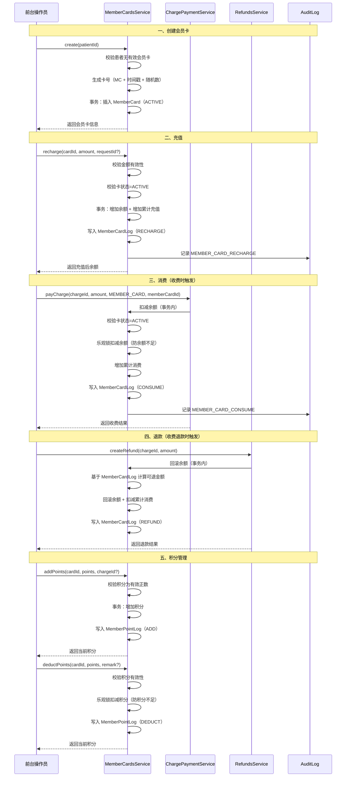

# 会员卡流程文档

## 概述

会员卡系统是口腔诊所管理系统的客户关系与财务管理模块，负责管理储值卡的充值、消费、退款和积分全流程。系统采用事务保证数据一致性，支持幂等性操作，并提供完整的流水记录。

## 流程图



## 一、会员卡类型与状态

### 1.1 卡类型

当前代码实现的是**储值卡**类型，支持以下核心功能：
- 储值充值
- 余额消费
- 消费退款
- 积分管理

> 注：折扣卡、次卡等类型尚未在代码中实现，可在后续版本中扩展。

### 1.2 卡状态

| 状态 | 说明 | 可充值 | 可消费 | 可退款 |
|------|------|--------|--------|--------|
| ACTIVE | 正常 | 是 | 是 | 是 |
| DISABLED | 已禁用 | 否 | 否 | 否 |
| FROZEN | 已冻结 | 否 | 否 | 否 |
| EXPIRED | 已过期 | 否 | 否 | 否 |

### 1.3 卡号生成规则
- 格式：`MC` + 时间戳 + 2字节随机十六进制 + 重试序号
- 示例：`MC1721856000000a1b2`
- 遇唯一约束冲突自动重试（最多 3 次）

位置：`src/modules/financial/member-cards/member-cards.service.ts:47-72`

## 二、充值流程

### 2.1 前置条件
- 会员卡存在
- 会员卡状态为 `ACTIVE`

### 2.2 流程步骤
1. **参数校验**：金额必须为有效正数
2. **状态校验**：卡状态必须为 ACTIVE
3. **事务更新**：
   - 余额增加：`balance = balance + amount`
   - 累计充值增加：`totalRecharge = totalRecharge + amount`
4. **记录流水**：写入 `MemberCardLog`（type: RECHARGE，amount 为正值）
5. **审计日志**：记录 `MEMBER_CARD_RECHARGE`

### 2.3 金额单位
- 存储单位：**分**（整数）
- 对外展示：**元**（浮点数，两位小数）

### 2.4 幂等性
传入 `requestId` 时启用幂等性，基于 `IdempotencyService` 实现。

位置：`src/modules/financial/member-cards/member-cards.service.ts:74-124`

## 三、消费流程

### 3.1 触发方式
会员卡消费主要在**收费支付**时触发，由 `ChargePaymentService` 调用。

### 3.2 前置条件
- 会员卡存在
- 会员卡状态为 `ACTIVE`
- 会员卡余额 ≥ 消费金额

### 3.3 流程步骤
1. **参数校验**：金额必须为有效正数
2. **状态校验**：卡状态必须为 ACTIVE
3. **乐观锁扣减**：
   ```sql
   UPDATE MemberCard 
   SET balance = balance - ?, totalConsume = totalConsume + ?
   WHERE id = ? AND status = 'ACTIVE' AND balance >= ?
   ```
4. **记录流水**：写入 `MemberCardLog`（type: CONSUME，amount 为负值）
5. **审计日志**：记录 `MEMBER_CARD_CONSUME`

### 3.4 并发控制
- 采用**乐观锁**防止余额扣成负数
- SQL 条件：`WHERE balance >= ?`
- 更新行数为 0 时抛出"余额不足"异常

位置：`src/modules/financial/member-cards/member-cards.service.ts:194-246`

## 四、退款流程

### 4.1 触发方式
会员卡退款主要在**收费退款**时触发，由 `RefundsService` 调用。

### 4.2 可退金额计算
退款时基于 `MemberCardLog` 精确计算该收费单的可退金额：

```
可退金额 = 该 charge 的累计消费（绝对值） - 该 charge 的累计已退款
```

其中：
- 累计消费 = SUM(amount) WHERE type = CONSUME AND chargeId = ?
- 累计已退款 = SUM(amount) WHERE type = REFUND AND chargeId = ?
- 实际退款 = min(本次退款金额, 可退金额)

### 4.3 流程步骤
1. 查询该 chargeId 对应的会员卡消费和退款历史
2. 计算实际可退金额
3. 校验卡状态为 ACTIVE
4. 回滚余额：`balance = balance + 实际退款`
5. 扣减累计消费：`totalConsume = MAX(0, totalConsume - 实际退款)`
6. 写入 `MemberCardLog`（type: REFUND，amount 为正值）

位置：`src/modules/financial/refunds/refunds.service.ts:163-216`

### 4.4 独立退款接口
会员卡服务也提供独立的 `refund()` 方法，用于非收费场景的退款。

位置：`src/modules/financial/member-cards/member-cards.service.ts:248-300`

## 五、积分管理

### 5.1 积分账户
- 积分字段：`MemberCard.points`
- 积分日志：`MemberPointLog`

### 5.2 增加积分
```
addPoints(cardId, points, chargeId?, remark?)
```

- 校验：积分必须为有效正数
- 操作：`points = points + 积分`
- 日志：`MemberPointLog`（type: ADD）

### 5.3 扣减积分
```
deductPoints(cardId, points, remark?)
```

- 校验：积分必须为有效正数
- 乐观锁：`WHERE points >= ?`
- 操作：`points = points - 积分`
- 日志：`MemberPointLog`（type: DEDUCT）
- 失败：抛出"积分不足"

位置：`src/modules/financial/member-cards/member-cards.service.ts:157-192`

## 六、流水记录

### 6.1 MemberCardLog（会员卡流水）

| 字段 | 类型 | 说明 |
|------|------|------|
| id | TEXT | 主键 |
| cardId | TEXT | 会员卡 ID |
| type | TEXT | 类型：RECHARGE / CONSUME / REFUND |
| amount | INTEGER | 变动金额（分），充值为正，消费为负，退款为正 |
| balanceAfter | INTEGER | 变动后余额（分） |
| chargeId | TEXT | 关联收费单 ID |
| remark | TEXT | 备注 |
| clinicId | TEXT | 诊所 ID |
| createdAt | TEXT | 创建时间 |

### 6.2 MemberPointLog（积分流水）

| 字段 | 类型 | 说明 |
|------|------|------|
| id | TEXT | 主键 |
| cardId | TEXT | 会员卡 ID |
| type | TEXT | 类型：ADD / DEDUCT |
| points | INTEGER | 变动积分 |
| balanceAfter | INTEGER | 变动后积分 |
| chargeId | TEXT | 关联收费单 ID |
| remark | TEXT | 备注 |
| clinicId | TEXT | 诊所 ID |
| createdAt | TEXT | 创建时间 |

## 七、相关数据库表

### 7.1 MemberCard（会员卡）

| 字段 | 类型 | 说明 |
|------|------|------|
| id | TEXT | 主键 |
| patientId | TEXT | 患者 ID |
| cardNo | TEXT | 卡号（唯一） |
| balance | INTEGER | 余额（分） |
| totalRecharge | INTEGER | 累计充值（分） |
| totalConsume | INTEGER | 累计消费（分） |
| points | INTEGER | 当前积分 |
| totalPoints | INTEGER | 累计积分 |
| level | TEXT | 等级（默认 NORMAL） |
| status | TEXT | 状态（ACTIVE/DISABLED/FROZEN/EXPIRED） |
| clinicId | TEXT | 诊所 ID |

### 7.2 约束
- 一患者一卡：通过应用层校验（`findByPatient` + 事务）
- 余额非负：`CHECK (balance >= 0)`
- 累计充值非负：`CHECK (totalRecharge >= 0)`
- 累计消费非负：`CHECK (totalConsume >= 0)`

## 八、异常处理

| 异常场景 | 错误信息 | 处理方式 |
|----------|----------|----------|
| 金额无效 | 充值/消费/退款金额必须为有效正数 | 前端校验 + 后端校验 |
| 患者已有卡 | 该患者已有会员卡 | 阻止创建 |
| 会员卡不存在 | 会员卡不存在 | 阻止操作 |
| 卡已禁用 | 会员卡已禁用，无法充值/消费/退款 | 阻止操作 |
| 卡状态异常 | 会员卡状态异常，无法消费 | 阻止操作 |
| 余额不足 | 余额不足 | 阻止消费 |
| 积分不足 | 积分不足 | 阻止积分扣减 |
| 积分无效 | 积分必须为有效正数 | 前端校验 + 后端校验 |
| 卡号冲突 | - | 自动重试（最多 3 次） |
| 并发冲突 | - | 乐观锁，后提交者失败 |

## 九、幂等性保证

### 9.1 支持幂等的操作
- 充值：`recharge(id, amount, requestId?)`
- 消费：`consume(id, amount, chargeId?, remark?, requestId?)`
- 退款：`refund(id, amount, chargeId?, remark?, requestId?)`

### 9.2 实现机制
- 基于 `IdempotencyService` 全局单例
- 幂等键格式：`{操作类型}:{卡ID}:{requestId}`
- 首次执行写入幂等记录，后续相同 key 直接返回首次结果

详见 ADR-0005：`docs/adr/0005-idempotency-service-single-instance.md`

## 十、架构设计要点

### 10.1 事务一致性
所有余额/积分变更操作均在数据库事务内执行，确保：
- 余额与流水一致
- 积分与流水一致
- 审计日志与业务操作一致

### 10.2 数据完整性
- 所有金额字段用 INTEGER（分）存储，避免浮点精度问题
- 数据库层 CHECK 约束保证余额非负
- 应用层乐观锁进一步保证并发安全

### 10.3 诊所隔离
所有会员卡数据通过 `clinicId` 字段实现多租户隔离。

### 10.4 软删除
会员卡采用软删除（`deletedAt`），保留历史数据用于审计和统计。
