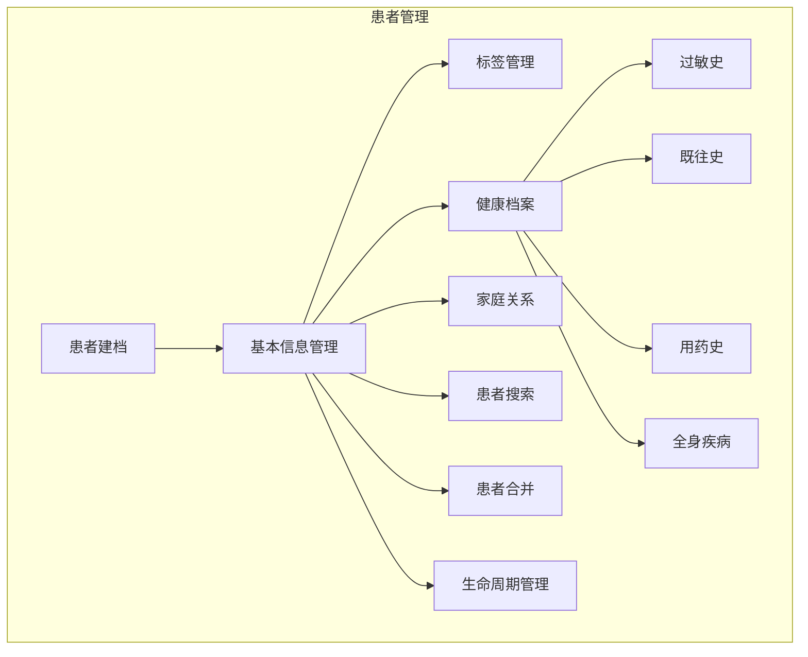
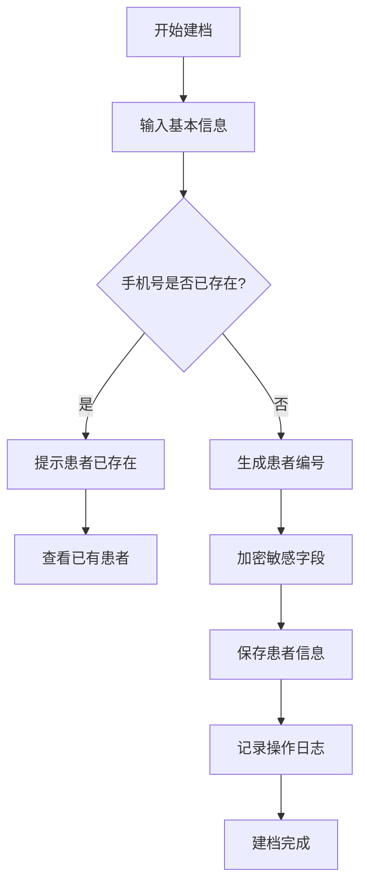
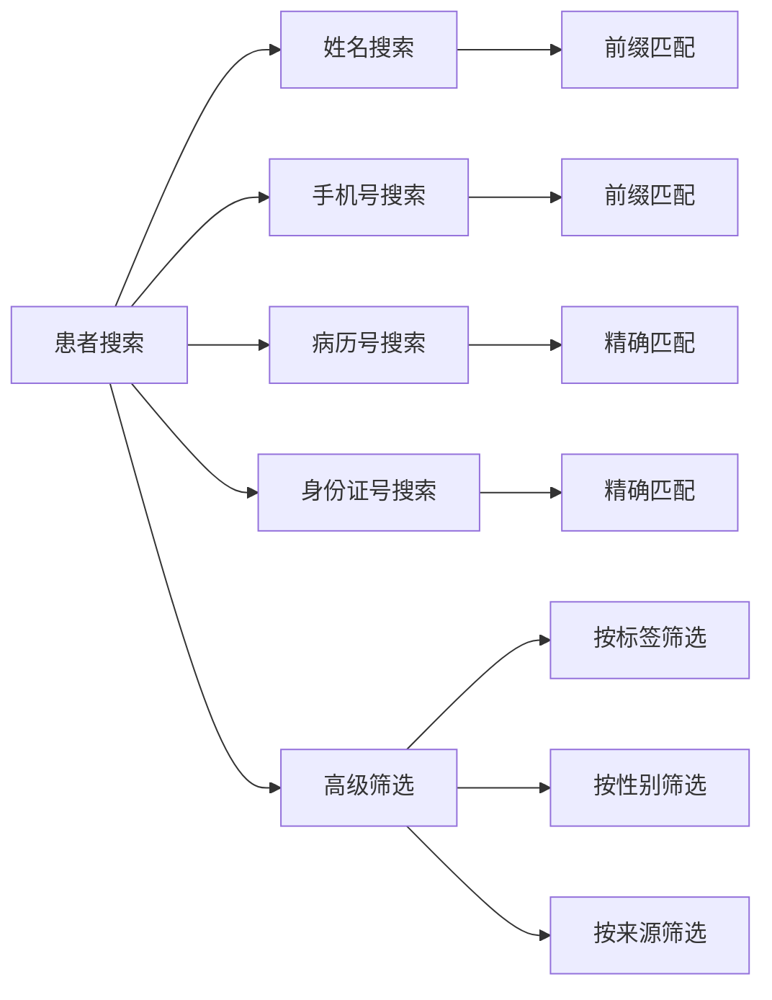
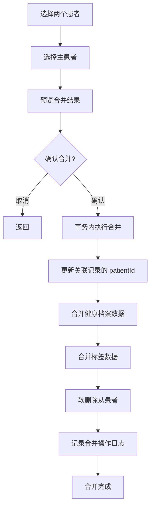
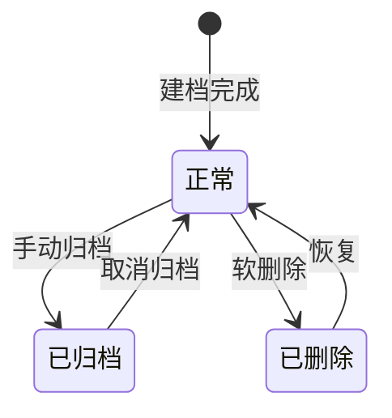

# 患者管理流程文档

## 1. 患者管理总览

患者管理是口腔诊所系统的核心模块，贯穿患者从建档、就诊、治疗到随访的全生命周期。系统提供完整的患者信息管理、标签分类、搜索查询、家庭关系等功能。

### 1.1 功能模块

### 1.2 患者信息构成

| 信息分类 | 包含内容 | 说明 |
|---------|---------|------|
| **基本信息** | 姓名、性别、出生日期、手机号、身份证号、地址、职业 | 患者身份识别信息 |
| **健康信息** | 过敏史、既往病史、用药史、全身疾病 | 临床安全警示信息 |
| **标签信息** | 自定义标签、来源渠道 | 患者分类与营销 |
| **关系信息** | 家庭关系、推荐人、紧急联系人 | 社交关系网络 |
| **系统信息** | 患者编号、创建时间、更新时间、状态 | 系统管理字段 |

---

## 2. 患者建档流程

### 2.1 建档流程图

### 2.2 字段说明

#### 必填字段

| 字段名 | 类型 | 长度 | 说明 | 验证规则 |
|--------|------|------|------|---------|
| `name` | string | 50 | 患者姓名 | 不能为空，最大 50 字符 |
| `gender` | enum | - | 性别 | MALE / FEMALE / UNKNOWN / OTHER |
| `phone` | string | 20 | 手机号 | 不能为空，11 位手机号格式 |

#### 可选字段

| 字段名 | 类型 | 长度 | 说明 | 验证规则 |
|--------|------|------|------|---------|
| `code` | string | 20 | 患者编号 | 不填则自动生成，格式 P + 序号 |
| `birthDate` | string | - | 出生日期 | ISO 日期格式 |
| `idCard` | string | 18 | 身份证号 | AES-256-GCM 加密存储 |
| `address` | string | 200 | 地址 | 最大 200 字符 |
| `occupation` | string | 50 | 职业 | 最大 50 字符 |
| `remark` | string | 2000 | 备注 | 最大 2000 字符 |
| `avatar` | string | 500 | 头像 URL | 最大 500 字符 |
| `source` | enum | - | 来源渠道 | WALK_IN / ONLINE / REFERRAL 等 |
| `familyId` | string | 100 | 家庭 ID | 关联家庭组 |
| `referrer` | string | 50 | 推荐人 | 最大 50 字符 |
| `emergencyContact` | string | 50 | 紧急联系人 | 最大 50 字符 |
| `emergencyPhone` | string | 20 | 紧急联系电话 | 最大 20 字符 |

#### 数组字段（JSON 存储）

| 字段名 | 类型 | 说明 |
|--------|------|------|
| `tags` | string[] | 患者标签列表 |
| `allergies` | string[] | 过敏史列表 |
| `medicalHistory` | string[] | 既往病史列表 |
| `medicationHistory` | string[] | 用药史列表 |
| `systemicDiseases` | string[] | 全身疾病列表 |

### 2.3 验证规则

#### 姓名验证

- 不能为空
- 最大长度 50 字符
- 自动去除首尾空格
- 特殊字符过滤（防 XSS）

#### 手机号验证

- 不能为空
- 必须为 11 位数字
- 必须以 1 开头，第二位为 3-9
- 同一诊所内手机号唯一

#### 身份证号验证

- 可选字段
- 最大长度 18 字符
- 存储时使用 AES-256-GCM 加密
- 列表展示时脱敏（前 6 后 4）
- 获取完整号码需要单独权限（BOSS 角色）

#### 患者编号生成规则

- 前缀：`P`
- 格式：`P` + 递增序号
- 全局唯一（诊所内唯一）
- 可手动指定，但不能重复
- 自动生成时处理并发冲突（最多重试 3 次）

---

## 3. 患者标签管理

### 3.1 标签类型

| 标签类型 | 说明 | 示例 |
|---------|------|------|
| **自定义标签** | 用户手动创建的标签 | VIP、儿童、老人、种植牙 |
| **来源标签** | 根据来源渠道自动打标 | 网络预约、朋友推荐、 walk-in |
| **系统标签** | 系统根据行为自动打标 | 首次就诊、高消费、欠费 |

### 3.2 自动打标规则

| 触发条件 | 自动添加标签 | 说明 |
|---------|-------------|------|
| 首次就诊完成 | `首次就诊` | 患者第一次完成就诊 |
| 消费金额 > 5000 | `高价值客户` | 累计消费超过阈值 |
| 有未结清费用 | `欠费` | 存在未支付的收费单 |
| 儿童患者（年龄 < 14） | `儿童` | 根据出生日期自动计算 |
| 老年患者（年龄 > 60） | `老人` | 根据出生日期自动计算 |

### 3.3 手动标签管理

- **添加标签**：在患者详情页编辑标签
- **移除标签**：取消标签选中
- **标签搜索**：按标签筛选患者列表
- **批量打标**：选中多个患者批量添加/移除标签

---

## 4. 患者搜索

### 4.1 搜索方式

系统支持多种搜索方式，满足不同场景需求。

### 4.2 模糊搜索规则

#### 搜索字段优先级

| 字段 | 匹配方式 | 触发条件 | 说明 |
|------|---------|---------|------|
| `name` | 前缀匹配 | 始终 | 姓名前缀匹配，如"张"匹配"张三" |
| `phone` | 前缀匹配 | 始终 | 手机号前缀匹配，如"138"匹配"138xxxx" |
| `code` | 前缀匹配 | 始终 | 患者编号前缀匹配 |
| `idCard` | 前缀匹配 | 输入为纯数字且 ≥ 8 位 | 身份证号匹配（加密字段模糊查询） |

#### 搜索性能优化

- 姓名、手机号、编号字段建立索引
- 仅前缀匹配（LIKE 'xxx%'）可利用索引
- 身份证号加密存储，搜索效率较低，限定触发条件
- 支持游标分页，优化大数据量查询

### 4.3 高级筛选

| 筛选项 | 类型 | 说明 |
|--------|------|------|
| 性别 | 单选 | 男 / 女 / 未知 / 其他 |
| 标签 | 多选 | 按患者标签筛选 |
| 来源 | 单选 | 按来源渠道筛选 |
| 出生日期范围 | 日期范围 | 按年龄或生日筛选 |
| 创建时间范围 | 日期范围 | 按建档时间筛选 |

---

## 5. 患者合并

### 5.1 合并场景

| 场景 | 说明 | 示例 |
|------|------|------|
| **重复建档** | 同一患者多次建档，信息略有不同 | 手机号输错、姓名同音不同字 |
| **信息补全** | 先有简档，后补全详细信息 | 预约时建档，就诊时补全 |
| **家庭合并** | 家庭成员分别建档，需关联家庭关系 | 夫妻、父子分别建档 |

### 5.2 合并规则

#### 主患者选择原则

1. 优先选择信息更完整的患者作为主患者
2. 优先选择有就诊记录的患者作为主患者
3. 优先选择创建时间更早的患者作为主患者
4. 也可手动指定主患者

#### 数据合并策略

| 数据类型 | 合并规则 | 说明 |
|---------|---------|------|
| **基本信息** | 主患者为准，缺失字段从从患者补充 | 姓名、手机号等关键字段以主患者为准 |
| **就诊记录** | 全部迁移到主患者 | 预约、就诊、收费、病历等 |
| **标签** | 取并集 | 两边的标签都保留 |
| **过敏史/病史** | 取并集，去重 | 健康信息合并 |
| **财务记录** | 全部迁移 | 收费、退款、会员卡 |
| **家庭关系** | 保留主患者的家庭关系 | 从患者的家庭关系需重新关联 |

### 5.3 合并数据处理

#### 合并流程

#### 合并后的关联表

患者合并时，以下关联表的 `patientId` 需要更新：

| 表名 | 说明 |
|------|------|
| `Appointment` | 预约记录 |
| `Visit` | 就诊记录 |
| `Treatment` | 治疗记录 |
| `TreatmentPlan` | 治疗计划 |
| `Charge` | 收费记录 |
| `Imaging` | 影像资料 |
| `Prescription` | 处方记录 |
| `ToothRecord` | 牙位记录 |
| `Registration` | 挂号记录 |
| `FollowUp` | 随访记录 |
| `MedicalRecord` | 病历记录 |
| `MemberCard` | 会员卡 |
| `Refund` | 退款记录 |
| `ProcessingOrder` | 加工单 |
| `FirstExam` | 初诊记录 |
| `OralExamination` | 口腔检查 |
| `PeriodontalRecord` | 牙周记录 |
| `DebtRecord` | 欠款记录 |
| `WechatMessage` | 微信消息 |

> **注意**：合并操作不可逆，执行前请仔细核对。合并后从患者将被软删除。

---

## 6. 过敏史与既往史

### 6.1 数据结构

患者健康档案包含四类健康信息，均为字符串数组存储（JSON 格式）。

| 字段 | 说明 | 示例值 |
|------|------|--------|
| `allergies` | 过敏史 | `["青霉素过敏", "花粉过敏"]` |
| `medicalHistory` | 既往病史 | `["高血压", "糖尿病"]` |
| `medicationHistory` | 用药史 | `["长期服用降压药"]` |
| `systemicDiseases` | 全身疾病 | `["心脏病", "肝病"]` |

### 6.2 预警机制

#### 预警触发场景

| 场景 | 预警方式 | 说明 |
|------|---------|------|
| 患者信息查看 | 醒目标识 | 患者详情页顶部显示过敏史警示 |
| 开处方时 | 弹窗确认 | 开药前提醒医生患者过敏史 |
| 治疗前 | 提醒确认 | 开始治疗前确认健康状况 |
| 预约挂号 | 标识提示 | 挂号时显示特殊健康标识 |

#### 高风险过敏药物

- 青霉素类抗生素
- 头孢类抗生素（交叉过敏）
- 磺胺类药物
- 局麻药（如普鲁卡因）

---

## 7. 家庭关系

### 7.1 关系类型

| 关系类型 | 说明 |
|---------|------|
| 夫妻 | 配偶关系 |
| 父子/父女 | 父亲与子女 |
| 母子/母女 | 母亲与子女 |
| 兄弟姐妹 | 兄弟姐妹 |
| 其他亲属 | 其他亲戚关系 |
| 朋友 | 非亲属关系 |

### 7.2 家庭组管理

#### 家庭组表结构

| 字段 | 类型 | 说明 |
|------|------|------|
| `id` | string | 家庭组 ID |
| `name` | string | 家庭组名称（如"张三家庭"） |
| `clinicId` | string | 所属诊所 |
| `createdAt` | string | 创建时间 |

#### 关联方式

- 患者表通过 `familyId` 字段关联到家庭组
- 一个家庭组可以包含多个患者
- 一个患者只能属于一个家庭组

### 7.3 关联就诊记录

家庭组支持：
- 查看家庭成员的就诊历史（有权限控制）
- 家庭账户统一支付（会员卡关联）
- 家庭口腔健康报告
- 预约提醒同步到家庭联系人

---

## 8. 患者生命周期状态

### 8.1 状态机图

### 8.2 状态转换规则

| 当前状态 | 目标状态 | 触发条件 | 说明 |
|---------|---------|---------|------|
| - | 正常 | 新建患者 | 初始状态 |
| 正常 | 已归档 | 手动操作 | 长期不来诊的患者归档 |
| 已归档 | 正常 | 取消归档 | 患者重新来诊 |
| 正常 | 已删除 | 删除操作 | 软删除，数据保留 |
| 已删除 | 正常 | 恢复操作 | 误删恢复 |

### 8.3 状态说明

| 状态 | `active` 值 | `deletedAt` | 查询默认包含 | 说明 |
|------|-------------|-------------|-------------|------|
| 正常 | 1 | NULL | 是 | 正常状态的患者 |
| 已归档 | 0 | NULL | 否 | 归档状态，默认不显示 |
| 已删除 | 1 | 有值 | 否 | 软删除，可恢复 |

---

## 9. 相关数据表结构

### 9.1 患者表 (Patient)

| 字段名 | 类型 | 约束 | 说明 |
|--------|------|------|------|
| `id` | TEXT | PRIMARY KEY | 患者 UUID |
| `code` | TEXT | UNIQUE NOT NULL | 患者编号 |
| `name` | TEXT | NOT NULL | 姓名 |
| `gender` | TEXT | NOT NULL, CHECK IN | 性别 |
| `birthDate` | TEXT | - | 出生日期 |
| `phone` | TEXT | NOT NULL | 手机号 |
| `idCard` | TEXT | - | 身份证号（加密） |
| `address` | TEXT | - | 地址 |
| `occupation` | TEXT | - | 职业 |
| `remark` | TEXT | - | 备注 |
| `avatar` | TEXT | - | 头像 |
| `tags` | TEXT | DEFAULT '[]' | 标签（JSON 数组） |
| `allergies` | TEXT | DEFAULT '[]' | 过敏史（JSON 数组） |
| `medicalHistory` | TEXT | DEFAULT '[]' | 既往史（JSON 数组） |
| `medicationHistory` | TEXT | DEFAULT '[]' | 用药史（JSON 数组） |
| `systemicDiseases` | TEXT | DEFAULT '[]' | 全身疾病（JSON 数组） |
| `source` | TEXT | DEFAULT 'WALK_IN' | 来源渠道 |
| `familyId` | TEXT | FOREIGN KEY | 家庭组 ID |
| `referrer` | TEXT | - | 推荐人 |
| `emergencyContact` | TEXT | - | 紧急联系人 |
| `emergencyPhone` | TEXT | - | 紧急联系电话 |
| `openId` | TEXT | - | 微信 OpenID |
| `clinicId` | TEXT | NOT NULL, FOREIGN KEY | 诊所 ID |
| `active` | INTEGER | DEFAULT 1, CHECK 0/1 | 是否启用 |
| `createdAt` | TEXT | DEFAULT CURRENT_TIMESTAMP | 创建时间 |
| `updatedAt` | TEXT | DEFAULT CURRENT_TIMESTAMP | 更新时间 |
| `deletedAt` | TEXT | - | 删除时间（软删除） |

### 9.2 家庭表 (Family)

| 字段名 | 类型 | 约束 | 说明 |
|--------|------|------|------|
| `id` | TEXT | PRIMARY KEY | 家庭组 UUID |
| `name` | TEXT | NOT NULL | 家庭组名称 |
| `clinicId` | TEXT | NOT NULL | 诊所 ID |
| `createdAt` | TEXT | DEFAULT CURRENT_TIMESTAMP | 创建时间 |

### 9.3 索引设计

| 索引名 | 字段 | 类型 | 说明 |
|--------|------|------|------|
| `idx_patient_code` | `code` | 唯一索引 | 患者编号快速查询 |
| `idx_patient_phone` | `phone, clinicId` | 普通索引 | 手机号搜索 |
| `idx_patient_name` | `name, clinicId` | 普通索引 | 姓名搜索 |
| `idx_patient_clinic` | `clinicId` | 普通索引 | 诊所过滤 |
| `idx_patient_deleted` | `deletedAt` | 普通索引 | 软删除过滤 |

---

## 10. 相关 API 清单

### 10.1 患者管理 API

| 方法 | 路径 | 说明 | 权限 |
|------|------|------|------|
| `POST` | `/patients` | 创建患者 | BOSS / DOCTOR / RECEPTIONIST |
| `GET` | `/patients` | 患者列表（分页+搜索） | BOSS / DOCTOR / RECEPTIONIST |
| `GET` | `/patients/:id` | 患者详情 | BOSS / DOCTOR / RECEPTIONIST |
| `PATCH` | `/patients/:id` | 更新患者信息 | BOSS / DOCTOR / RECEPTIONIST |
| `DELETE` | `/patients/:id` | 删除患者（软删除） | BOSS / DOCTOR / RECEPTIONIST |
| `GET` | `/patients/:id/full-id-card` | 获取完整身份证号 | BOSS |

### 10.2 相关业务 API

| 模块 | 相关 API | 说明 |
|------|---------|------|
| 预约 | `GET /appointments?patientId=xxx` | 查询患者预约 |
| 就诊 | `GET /visits?patientId=xxx` | 查询患者就诊记录 |
| 收费 | `GET /charges?patientId=xxx` | 查询患者收费记录 |
| 病历 | `GET /medical-records?patientId=xxx` | 查询患者病历 |
| 会员卡 | `GET /member-cards?patientId=xxx` | 查询患者会员卡 |
| 随访 | `GET /follow-ups?patientId=xxx` | 查询患者随访记录 |

---

## 11. 安全与隐私

### 11.1 敏感数据保护

| 数据项 | 保护措施 |
|--------|---------|
| 身份证号 | AES-256-GCM 加密存储，列表脱敏显示 |
| 手机号 | 列表脱敏显示，获取完整号码需审计日志 |
| 住址 | 适当权限控制 |
| 健康信息 | 仅医护人员可查看 |

### 11.2 权限控制

| 操作 | BOSS | DOCTOR | RECEPTIONIST |
|------|------|--------|-------------|
| 查看患者列表 | ✓ | ✓ | ✓ |
| 查看患者详情 | ✓ | ✓ | ✓ |
| 创建患者 | ✓ | ✓ | ✓ |
| 更新患者信息 | ✓ | ✓ | ✓ |
| 删除患者 | ✓ | ✗ | ✗ |
| 查看完整身份证号 | ✓ | ✗ | ✗ |
| 查看完整手机号 | ✓ | ✓ | ✓（需审计） |

### 11.3 审计日志

所有敏感操作都会记录审计日志：
- 创建/更新/删除患者
- 查看完整身份证号
- 查看完整手机号
- 患者合并操作

---

## 12. 相关文件

| 文件路径 | 说明 |
|---------|------|
| `src/modules/patients/patients.service.ts` | 患者服务 |
| `src/modules/patients/patients.controller.ts` | 患者控制器 |
| `src/modules/patients/dto/create-patient.dto.ts` | 创建患者 DTO |
| `src/modules/patients/dto/update-patient.dto.ts` | 更新患者 DTO |
| `src/db/schema/patient.tables.ts` | 患者相关表结构 |
| `src/common/utils/security/encryption.ts` | 加密工具 |
| `src/common/utils/security/mask.ts` | 脱敏工具 |
