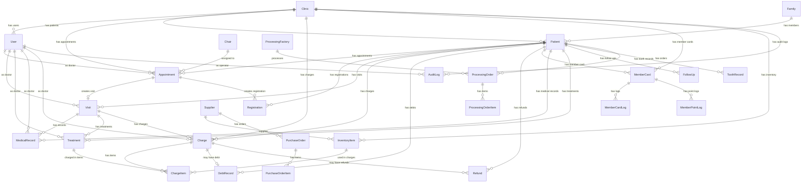

# 数据库设计文档

## 1. 概述

### 1.1 数据库选型

本项目采用 **SQLite + better-sqlite3** 作为数据库解决方案，选型依据如下：

- **嵌入式数据库**：无需单独部署数据库服务，降低运维成本
- **高性能同步 API**：better-sqlite3 提供同步 API，简化异步编程复杂度
- **单文件存储**：整个数据库存储在单个文件中，便于备份和迁移
- **事务支持**：完整的 ACID 事务支持，保证数据一致性
- **零配置**：开箱即用，无需复杂的配置和调优

### 1.2 设计原则

#### 多租户隔离
所有业务表均包含 `clinicId` 字段，实现诊所级别的数据隔离。查询时通过 `clinicId` 自动过滤，确保不同诊所数据互不干扰。

#### 软删除
核心业务表采用软删除机制，通过 `deletedAt` 字段标记删除状态而非物理删除，便于数据恢复和审计追踪。

#### 审计日志
关键操作通过 `AuditLog` 表记录操作前后的数据快照，支持完整的操作追溯。

#### JSON 扩展字段
对于结构灵活的数据（如标签、过敏史、牙位等），采用 JSON 格式存储在 TEXT 字段中，兼顾灵活性和查询性能。

---

## 2. ER 图

---

## 3. 核心表详细说明

### 3.1 Patient - 患者表

#### 表说明
存储患者基本信息，是整个系统的核心实体之一。

#### 字段列表

| 字段名 | 类型 | 必填 | 说明 |
|--------|------|------|------|
| id | TEXT | 是 | 主键，UUID 格式 |
| code | TEXT | 是 | 患者编号，诊所内唯一 |
| name | TEXT | 是 | 患者姓名 |
| gender | TEXT | 是 | 性别：MALE/FEMALE/UNKNOWN/OTHER |
| birthDate | TEXT | 否 | 出生日期 |
| phone | TEXT | 是 | 联系电话 |
| idCard | TEXT | 否 | 身份证号 |
| address | TEXT | 否 | 住址 |
| occupation | TEXT | 否 | 职业 |
| remark | TEXT | 否 | 备注 |
| avatar | TEXT | 否 | 头像 URL |
| tags | TEXT | 否 | 标签，JSON 数组，默认 `[]` |
| allergies | TEXT | 否 | 过敏史，JSON 数组，默认 `[]` |
| medicalHistory | TEXT | 否 | 疾病史，JSON 数组，默认 `[]` |
| medicationHistory | TEXT | 否 | 用药史，JSON 数组，默认 `[]` |
| systemicDiseases | TEXT | 否 | 全身疾病，JSON 数组，默认 `[]` |
| source | TEXT | 否 | 来源渠道，默认 WALK_IN |
| familyId | TEXT | 否 | 家庭 ID，关联 Family 表 |
| referrer | TEXT | 否 | 推荐人 |
| emergencyContact | TEXT | 否 | 紧急联系人 |
| emergencyPhone | TEXT | 否 | 紧急联系电话 |
| openId | TEXT | 否 | 微信 OpenID |
| clinicId | TEXT | 是 | 诊所 ID，多租户隔离 |
| active | INTEGER | 否 | 是否活跃：0/1，默认 1 |
| createdAt | TEXT | 否 | 创建时间，默认 CURRENT_TIMESTAMP |
| updatedAt | TEXT | 否 | 更新时间，默认 CURRENT_TIMESTAMP |
| deletedAt | TEXT | 否 | 删除时间，软删除标记 |

#### 索引
- `idx_patient_clinic` - clinicId（多租户查询）
- `idx_patient_name` - name（姓名搜索）
- `idx_patient_phone` - phone（电话搜索）
- `idx_patient_code` - code（编号查询）
- `idx_patient_source` - source（来源筛选）
- `idx_patient_created` - createdAt（创建时间排序）
- `idx_patient_clinic_created` - clinicId, deletedAt, createdAt（多租户分页列表）
- `idx_patient_clinic_name` - clinicId, name（多租户姓名搜索）
- `idx_patient_clinic_phone` - clinicId, phone（多租户电话搜索）
- `idx_patient_clinic_code` - clinicId, code（多租户编号查询）

#### 关系
- 多对一：`clinicId` → Clinic
- 多对一：`familyId` → Family
- 一对多：Appointment、Registration、Visit、Charge、MedicalRecord、Treatment 等

---

### 3.2 Charge / ChargeItem - 收费相关

#### Charge - 收费单表

##### 表说明
记录患者的收费单据，包含收费总金额、支付状态等信息。

##### 字段列表

| 字段名 | 类型 | 必填 | 说明 |
|--------|------|------|------|
| id | TEXT | 是 | 主键，UUID 格式 |
| patientId | TEXT | 是 | 患者 ID |
| visitId | TEXT | 否 | 就诊 ID |
| doctorId | TEXT | 否 | 医生 ID |
| number | TEXT | 是 | 收费单号，全局唯一 |
| totalAmount | INTEGER | 是 | 总金额（分），>= 0 |
| paidAmount | INTEGER | 否 | 已付金额（分），默认 0 |
| refundedAmount | INTEGER | 否 | 已退金额（分），默认 0 |
| discount | INTEGER | 否 | 折扣金额（分），默认 0 |
| status | TEXT | 否 | 状态：UNPAID/PARTIAL/PAID/REFUNDED/CANCELLED |
| payMethod | TEXT | 否 | 支付方式 |
| paidAt | TEXT | 否 | 支付时间 |
| remark | TEXT | 否 | 备注 |
| clinicId | TEXT | 是 | 诊所 ID |
| createdAt | TEXT | 否 | 创建时间 |
| updatedAt | TEXT | 否 | 更新时间 |
| deletedAt | TEXT | 否 | 删除时间，软删除 |

##### 索引
- `idx_charge_patient` - patientId
- `idx_charge_status` - status
- `idx_charge_visit` - visitId
- `idx_charge_paid_at_status` - paidAt, status
- `idx_charge_doctor_paid` - doctorId, paidAt
- `idx_charge_clinic_number` - clinicId, number
- `idx_charge_clinic_status` - clinicId, status
- `idx_charge_clinic_paidat` - clinicId, paidAt
- `idx_charge_clinic_patient` - clinicId, patientId
- `idx_charge_clinic_deleted_created` - clinicId, deletedAt, createdAt
- `idx_charge_paidat_clinic` - paidAt, clinicId（部分索引，deletedAt IS NULL）
- `idx_charge_status_clinic` - status, clinicId（部分索引，deletedAt IS NULL）

##### 关系
- 多对一：patientId → Patient
- 多对一：visitId → Visit
- 多对一：doctorId → User
- 一对多：ChargeItem（级联删除）
- 一对一：DebtRecord
- 一对多：Refund

---

#### ChargeItem - 收费明细表

##### 表说明
收费单的明细项目，可关联治疗项目或库存物品。

##### 字段列表

| 字段名 | 类型 | 必填 | 说明 |
|--------|------|------|------|
| id | TEXT | 是 | 主键 |
| chargeId | TEXT | 是 | 收费单 ID |
| treatmentId | TEXT | 否 | 治疗项目 ID |
| inventoryItemId | TEXT | 否 | 库存物品 ID |
| consumedQuantity | REAL | 否 | 消耗数量，默认 0 |
| name | TEXT | 是 | 项目名称 |
| category | TEXT | 是 | 项目分类 |
| price | INTEGER | 是 | 单价（分），>= 0 |
| quantity | INTEGER | 否 | 数量，默认 1，>= 1 |
| teethNumbers | TEXT | 否 | 涉及牙位，JSON 数组 |
| subtotal | INTEGER | 否 | 小计（分），默认 0 |
| clinicId | TEXT | 是 | 诊所 ID |
| createdAt | TEXT | 否 | 创建时间 |
| updatedAt | TEXT | 否 | 更新时间 |
| deletedAt | TEXT | 否 | 删除时间，软删除 |

##### 索引
- `idx_charge_item_order` - chargeId
- `idx_charge_item_inventory` - inventoryItemId
- `idx_charge_item_treatment` - treatmentId

##### 关系
- 多对一：chargeId → Charge（级联删除）
- 多对一：treatmentId → Treatment
- 多对一：inventoryItemId → InventoryItem

---

### 3.3 Appointment - 预约表

#### 表说明
记录患者的预约信息，包括预约时间、医生、牙椅等。

#### 字段列表

| 字段名 | 类型 | 必填 | 说明 |
|--------|------|------|------|
| id | TEXT | 是 | 主键 |
| patientId | TEXT | 是 | 患者 ID |
| doctorId | TEXT | 是 | 医生 ID |
| chairId | TEXT | 否 | 牙椅 ID |
| startTime | TEXT | 是 | 开始时间 |
| endTime | TEXT | 是 | 结束时间 |
| status | TEXT | 否 | 状态：BOOKED/ARRIVED/IN_CHAIR/COMPLETED/CANCELLED/NO_SHOW |
| type | TEXT | 是 | 预约类型 |
| remark | TEXT | 否 | 备注 |
| visitId | TEXT | 否 | 关联就诊 ID |
| clinicId | TEXT | 是 | 诊所 ID |
| createdAt | TEXT | 否 | 创建时间 |
| updatedAt | TEXT | 否 | 更新时间 |
| deletedAt | TEXT | 否 | 删除时间，软删除 |

#### 索引
- `idx_appointment_doctor` - doctorId
- `idx_appointment_patient` - patientId
- `idx_appointment_start_time` - startTime
- `idx_appointment_status` - status
- `idx_appointment_doctor_start` - doctorId, startTime
- `idx_appointment_start_status` - startTime, status
- `idx_appointment_clinic_start` - clinicId, startTime
- `idx_appointment_clinic_status` - clinicId, status
- `idx_appointment_clinic_doctor` - clinicId, doctorId
- `idx_appointment_clinic_patient` - clinicId, patientId
- `idx_appointment_starttime_clinic` - startTime, clinicId（部分索引，deletedAt IS NULL）

#### 关系
- 多对一：patientId → Patient
- 多对一：doctorId → User
- 多对一：chairId → Chair
- 一对一：visitId → Visit
- 一对多：Registration

---

### 3.4 MedicalRecord - 病历表

#### 表说明
存储患者的病历信息，支持模板、锁定、修改申请等功能。

#### 字段列表

| 字段名 | 类型 | 必填 | 说明 |
|--------|------|------|------|
| id | TEXT | 是 | 主键 |
| patientId | TEXT | 是 | 患者 ID |
| visitId | TEXT | 否 | 就诊 ID |
| doctorId | TEXT | 是 | 医生 ID |
| templateId | TEXT | 否 | 病历模板 ID |
| chiefComplaint | TEXT | 否 | 主诉 |
| presentIllness | TEXT | 否 | 现病史 |
| pastHistory | TEXT | 否 | 既往史 |
| allergyHistory | TEXT | 否 | 过敏史 |
| examination | TEXT | 否 | 检查所见 |
| diagnosis | TEXT | 否 | 诊断 |
| treatmentPlan | TEXT | 否 | 治疗计划 |
| teethInvolved | TEXT | 否 | 涉及牙位，JSON 数组 |
| images | TEXT | 否 | 影像图片，JSON 数组 |
| signature | TEXT | 否 | 医生签名 |
| isLocked | INTEGER | 否 | 是否已锁定：0/1，默认 0 |
| lockedAt | TEXT | 否 | 锁定时间 |
| lockedBy | TEXT | 否 | 锁定人 |
| modifyRequestId | TEXT | 否 | 修改申请 ID |
| clinicId | TEXT | 是 | 诊所 ID |
| createdAt | TEXT | 否 | 创建时间 |
| updatedAt | TEXT | 否 | 更新时间 |
| deletedAt | TEXT | 否 | 删除时间，软删除 |

#### 索引
- `idx_medical_record_patient` - patientId
- `idx_medical_record_visit` - visitId
- `idx_medical_record_doctor_created` - doctorId, createdAt
- `idx_medical_record_clinic_patient` - clinicId, patientId
- `idx_medicalrecord_clinic_deleted_created` - clinicId, deletedAt, createdAt

#### 关系
- 多对一：patientId → Patient
- 多对一：visitId → Visit
- 多对一：doctorId → User
- 一对多：RecordModifyRequest

---

### 3.5 MemberCard / MemberCardLog - 会员卡

#### MemberCard - 会员卡表

##### 表说明
患者的会员卡信息，包括余额、积分、等级等。

##### 字段列表

| 字段名 | 类型 | 必填 | 说明 |
|--------|------|------|------|
| id | TEXT | 是 | 主键 |
| patientId | TEXT | 是 | 患者 ID |
| cardNo | TEXT | 是 | 卡号，全局唯一 |
| balance | INTEGER | 否 | 余额（分），默认 0 |
| totalRecharge | INTEGER | 否 | 累计充值（分），默认 0 |
| totalConsume | INTEGER | 否 | 累计消费（分），默认 0 |
| points | INTEGER | 否 | 当前积分，默认 0 |
| totalPoints | INTEGER | 否 | 累计积分，默认 0 |
| level | TEXT | 否 | 等级：NORMAL/SILVER/GOLD/PLATINUM，默认 NORMAL |
| status | TEXT | 否 | 状态：ACTIVE/DISABLED/FROZEN/EXPIRED，默认 ACTIVE |
| clinicId | TEXT | 是 | 诊所 ID |
| createdAt | TEXT | 否 | 创建时间 |
| updatedAt | TEXT | 否 | 更新时间 |
| deletedAt | TEXT | 否 | 删除时间，软删除 |

##### 索引
- `idx_member_card_patient` - patientId
- `idx_member_card_status` - status
- `idx_member_card_status_balance` - status, balance
- `idx_member_card_clinic_patient` - clinicId, patientId
- `idx_membercard_clinic_deleted_created` - clinicId, deletedAt, createdAt
- `idx_membercard_status_clinic` - status, clinicId（部分索引，deletedAt IS NULL）

##### 关系
- 多对一：patientId → Patient
- 一对多：MemberCardLog（级联删除）
- 一对多：MemberPointLog（级联删除）

---

#### MemberCardLog - 会员卡流水表

##### 表说明
会员卡余额变动流水记录。

##### 字段列表

| 字段名 | 类型 | 必填 | 说明 |
|--------|------|------|------|
| id | TEXT | 是 | 主键 |
| cardId | TEXT | 是 | 会员卡 ID |
| type | TEXT | 是 | 类型：RECHARGE/CONSUME/REFUND |
| amount | INTEGER | 是 | 变动金额（分） |
| balanceAfter | INTEGER | 否 | 变动后余额 |
| chargeId | TEXT | 否 | 关联收费单 ID |
| remark | TEXT | 否 | 备注 |
| clinicId | TEXT | 是 | 诊所 ID |
| createdAt | TEXT | 否 | 创建时间 |

##### 索引
- `idx_member_card_log_card` - cardId
- `idx_membercardlog_charge` - chargeId
- `idx_membercardlog_card_created` - cardId, createdAt DESC

##### 关系
- 多对一：cardId → MemberCard（级联删除）
- 多对一：chargeId → Charge

---

### 3.6 User - 用户表

#### 表说明
系统用户表，包括老板、医生、前台、护士、管理员等角色。

#### 字段列表

| 字段名 | 类型 | 必填 | 说明 |
|--------|------|------|------|
| id | TEXT | 是 | 主键 |
| username | TEXT | 是 | 用户名，诊所内唯一 |
| passwordHash | TEXT | 是 | 密码哈希 |
| name | TEXT | 是 | 姓名 |
| role | TEXT | 否 | 角色：BOSS/DOCTOR/RECEPTIONIST/NURSE/ADMIN |
| phone | TEXT | 否 | 手机号 |
| active | INTEGER | 否 | 是否激活：0/1，默认 1 |
| loginAttempts | INTEGER | 否 | 登录失败次数，默认 0 |
| lockedUntil | TEXT | 否 | 锁定截止时间 |
| passwordNeedsRehash | INTEGER | 否 | 密码是否需要重新哈希，默认 0 |
| tokenVersion | INTEGER | 否 | Token 版本号，默认 0 |
| refreshToken | TEXT | 否 | 刷新 Token |
| refreshTokenExpiresAt | TEXT | 否 | 刷新 Token 过期时间 |
| passwordChangedAt | TEXT | 否 | 密码修改时间 |
| isTempPassword | INTEGER | 否 | 是否临时密码：0/1，默认 0 |
| clinicId | TEXT | 是 | 诊所 ID |
| createdAt | TEXT | 否 | 创建时间 |
| updatedAt | TEXT | 否 | 更新时间 |

#### 索引
- `idx_user_clinic` - clinicId
- `idx_user_username` - username
- `idx_user_role` - role

#### 约束
- UNIQUE(clinicId, username) - 诊所内用户名唯一

#### 关系
- 多对一：clinicId → Clinic
- 一对多：Appointment（作为医生）
- 一对多：Visit（作为医生）
- 一对多：Treatment（作为医生）
- 一对多：MedicalRecord（作为医生）

---

### 3.7 AuditLog - 审计日志表

#### 表说明
记录系统关键操作的审计日志，包含操作前后的数据快照。

#### 字段列表

| 字段名 | 类型 | 必填 | 说明 |
|--------|------|------|------|
| id | TEXT | 是 | 主键 |
| type | TEXT | 是 | 操作类型 |
| targetId | TEXT | 是 | 目标对象 ID |
| targetType | TEXT | 是 | 目标对象类型 |
| operatorId | TEXT | 否 | 操作人 ID |
| operatorName | TEXT | 否 | 操作人姓名 |
| amount | REAL | 否 | 金额（财务相关操作） |
| beforeData | TEXT | 否 | 操作前数据，JSON 格式 |
| afterData | TEXT | 否 | 操作后数据，JSON 格式 |
| remark | TEXT | 否 | 备注 |
| ip | TEXT | 否 | 操作 IP 地址 |
| userAgent | TEXT | 否 | 客户端 User-Agent |
| source | TEXT | 否 | 操作来源 |
| clinicId | TEXT | 是 | 诊所 ID |
| createdAt | TEXT | 否 | 创建时间 |

#### 索引
- `idx_audit_target` - targetType, targetId, createdAt DESC
- `idx_audit_operator` - operatorId, createdAt DESC
- `idx_audit_clinic_created` - clinicId, createdAt DESC

#### 关系
- 多对一：operatorId → User
- 多对一：clinicId → Clinic

---

### 3.8 InventoryItem - 库存物品表

#### 表说明
库存物品信息，包括材料、药品、耗材等。

#### 字段列表

| 字段名 | 类型 | 必填 | 说明 |
|--------|------|------|------|
| id | TEXT | 是 | 主键 |
| code | TEXT | 是 | 物品编码，唯一 |
| name | TEXT | 是 | 物品名称 |
| spec | TEXT | 否 | 规格 |
| category | TEXT | 是 | 分类 |
| unit | TEXT | 是 | 单位 |
| stock | REAL | 否 | 当前库存，默认 0 |
| minStock | REAL | 否 | 最低库存预警，默认 0 |
| price | INTEGER | 否 | 单价（分），默认 0 |
| supplierId | TEXT | 否 | 供应商 ID |
| expireDate | TEXT | 否 | 过期日期 |
| location | TEXT | 否 | 存放位置 |
| remark | TEXT | 否 | 备注 |
| clinicId | TEXT | 是 | 诊所 ID |
| createdAt | TEXT | 否 | 创建时间 |
| updatedAt | TEXT | 否 | 更新时间 |
| deletedAt | TEXT | 否 | 删除时间，软删除 |

#### 索引
- `idx_inventory_item_code` - code
- `idx_inventory_item_category` - category
- `idx_inventory_item_supplier` - supplierId
- `idx_inventory_item_clinic_category` - clinicId, category
- `idx_inventoryitem_clinic_deleted_created` - clinicId, deletedAt, createdAt

#### 关系
- 多对一：supplierId → Supplier
- 多对一：clinicId → Clinic
- 一对多：ChargeItem
- 一对多：InventoryTransaction

---

### 3.9 Registration - 挂号表

#### 表说明
患者挂号记录，关联就诊和预约。

#### 字段列表

| 字段名 | 类型 | 必填 | 说明 |
|--------|------|------|------|
| id | TEXT | 是 | 主键 |
| patientId | TEXT | 是 | 患者 ID |
| doctorId | TEXT | 否 | 医生 ID |
| type | TEXT | 是 | 挂号类型 |
| status | TEXT | 否 | 状态：REGISTERED/TRIAGED/IN_PROGRESS/COMPLETED/CANCELLED |
| visitId | TEXT | 否 | 就诊 ID |
| appointmentId | TEXT | 否 | 预约 ID |
| triageNote | TEXT | 否 | 分诊备注 |
| chiefComplaint | TEXT | 否 | 主诉 |
| registeredBy | TEXT | 否 | 挂号人 |
| registeredAt | TEXT | 否 | 挂号时间 |
| triagedAt | TEXT | 否 | 分诊时间 |
| startedAt | TEXT | 否 | 开始时间 |
| completedAt | TEXT | 否 | 完成时间 |
| clinicId | TEXT | 是 | 诊所 ID |
| createdAt | TEXT | 否 | 创建时间 |
| updatedAt | TEXT | 否 | 更新时间 |
| deletedAt | TEXT | 否 | 删除时间，软删除 |

#### 索引
- `idx_registration_patient` - patientId
- `idx_registration_status` - status
- `idx_registration_doctor_status` - doctorId, status
- `idx_registration_status_registered` - status, registeredAt
- `idx_registration_clinic_status` - clinicId, status

#### 关系
- 多对一：patientId → Patient
- 多对一：doctorId → User
- 多对一：visitId → Visit
- 多对一：appointmentId → Appointment

---

### 3.10 DebtRecord - 欠费记录表

#### 表说明
患者欠费记录，关联收费单。

#### 字段列表

| 字段名 | 类型 | 必填 | 说明 |
|--------|------|------|------|
| id | TEXT | 是 | 主键 |
| chargeId | TEXT | 是 | 收费单 ID，唯一 |
| patientId | TEXT | 是 | 患者 ID |
| totalAmount | INTEGER | 是 | 总欠费金额（分） |
| paidAmount | INTEGER | 否 | 已还金额（分），默认 0 |
| debtAmount | INTEGER | 是 | 待还金额（分），>= 0 |
| status | TEXT | 否 | 状态：UNPAID/PARTIAL/PAID/CANCELLED |
| lastPaymentAt | TEXT | 否 | 最后还款时间 |
| remark | TEXT | 否 | 备注 |
| clinicId | TEXT | 是 | 诊所 ID |
| createdAt | TEXT | 否 | 创建时间 |
| updatedAt | TEXT | 否 | 更新时间 |
| deletedAt | TEXT | 否 | 删除时间，软删除 |

#### 索引
- `idx_debt_patient` - patientId
- `idx_debt_status` - status
- `idx_debt_charge` - chargeId
- `idx_debt_created` - createdAt
- `idx_debt_charge_unique` - chargeId（唯一索引）
- `idx_debt_clinic_status` - clinicId, status
- `idx_debt_clinic_patient` - clinicId, patientId
- `idx_debtrecord_clinic_deleted_created` - clinicId, deletedAt, createdAt

#### 关系
- 一对一：chargeId → Charge
- 多对一：patientId → Patient

---

### 3.11 Refund - 退款表

#### 表说明
退款记录，关联收费单。

#### 字段列表

| 字段名 | 类型 | 必填 | 说明 |
|--------|------|------|------|
| id | TEXT | 是 | 主键 |
| chargeId | TEXT | 是 | 收费单 ID |
| patientId | TEXT | 是 | 患者 ID |
| amount | INTEGER | 是 | 退款金额（分），> 0 |
| reason | TEXT | 否 | 退款原因 |
| operatorId | TEXT | 否 | 操作人 ID |
| operatorName | TEXT | 否 | 操作人姓名 |
| clinicId | TEXT | 是 | 诊所 ID |
| createdAt | TEXT | 否 | 创建时间 |
| updatedAt | TEXT | 否 | 更新时间 |
| deletedAt | TEXT | 否 | 删除时间，软删除 |

#### 索引
- `idx_refund_charge` - chargeId
- `idx_refund_patient` - patientId
- `idx_refund_created` - createdAt
- `idx_refund_clinic_charge` - clinicId, chargeId
- `idx_refund_clinic_deleted_created` - clinicId, deletedAt, createdAt

#### 关系
- 多对一：chargeId → Charge
- 多对一：patientId → Patient
- 多对一：operatorId → User

---

## 4. 设计特点

### 4.1 多租户设计

**实现方式**：所有业务表都包含 `clinicId` 字段，作为数据隔离的核心字段。

**查询过滤**：通过 `ClinicContextService` 和 `clinic-filter` 工具，在查询时自动追加 `clinicId` 过滤条件，确保用户只能访问自己诊所的数据。

**复合索引**：高频查询表都建立了以 `clinicId` 为前缀的复合索引，优化多租户查询性能，例如：
- `idx_charge_clinic_status` - Charge(clinicId, status)
- `idx_appointment_clinic_start` - Appointment(clinicId, startTime)
- `idx_patient_clinic_name` - Patient(clinicId, name)

**唯一性约束**：User 表采用 `UNIQUE(clinicId, username)` 复合唯一约束，允许不同诊所使用相同的用户名。

### 4.2 软删除机制

**实现方式**：核心业务表通过 `deletedAt` 字段实现软删除。当 `deletedAt` 为 NULL 时表示记录有效，非 NULL 时表示已删除。

**级联软删除**：对于有父子关系的表（如 Charge → ChargeItem），删除父记录时通过 `SoftDeleteManager` 级联更新子记录的 `deletedAt` 字段。

**查询过滤**：`BaseService` 和 `BaseRepository` 自动过滤已删除的记录，默认只查询 `deletedAt IS NULL` 的数据。

**索引优化**：建立包含 `deletedAt` 的复合索引（如 `clinicId, deletedAt, createdAt`），优化分页列表查询性能。

### 4.3 审计日志

**AuditLog 表**：记录所有关键操作，包含：
- 操作类型（type）和目标对象（targetType + targetId）
- 操作人信息（operatorId + operatorName）
- 操作前后数据快照（beforeData + afterData，JSON 格式）
- IP 地址、User-Agent、操作来源等上下文信息

**索引策略**：
- 按目标查询：`targetType, targetId, createdAt DESC`
- 按操作人查询：`operatorId, createdAt DESC`
- 按诊所查询：`clinicId, createdAt DESC`

### 4.4 JSON 扩展字段

**使用场景**：
- 患者标签、过敏史、疾病史等数组型数据
- 牙位信息（teethNumbers）
- 影像图片列表（images）
- 牙周记录数据（data）

**存储方式**：存储为 TEXT 类型，内容为 JSON 字符串。

**优缺点**：
- 优点：灵活扩展，无需修改表结构
- 缺点：无法利用数据库索引进行高效查询（SQLite 支持 JSON 索引但使用较少）

### 4.5 业务编码生成规则

系统中有多种业务编码，通过 `CodeGeneratorService` 统一生成：

| 编码类型 | 表名 | 字段 | 说明 |
|----------|------|------|------|
| 患者编号 | Patient | code | 患者唯一编号 |
| 收费单号 | Charge | number | 收费单唯一编号 |
| 采购单号 | PurchaseOrder | number | 采购单唯一编号 |
| 加工单号 | ProcessingOrder | number | 加工单唯一编号 |
| 物品编码 | InventoryItem | code | 库存物品编码 |
| 会员卡卡号 | MemberCard | cardNo | 会员卡唯一卡号 |

### 4.6 索引策略

详见 [index-strategy.md](./index-strategy.md)。

---

## 5. 迁移管理

### 5.1 迁移文件位置

- 迁移逻辑：`src/db/migrations.ts`
- 表定义：`src/db/schema/*.tables.ts`
- 索引定义：`src/db/schema/indexes.ts`
- 迁移版本表：`schema_migrations`

### 5.2 迁移版本号规则

- 采用递增整数版本号（1, 2, 3, ...）
- 当前最新版本：**22**
- 版本号存储在 `schema_migrations` 表中
- 同时使用 SQLite 的 `user_version` PRAGMA 记录当前版本

### 5.3 迁移执行时机

迁移在应用启动时自动执行，流程如下：

1. 检查 `schema_migrations` 表是否存在，不存在则创建
2. 获取当前数据库版本
3. 按版本号顺序执行未应用的迁移
4. 记录每次迁移的版本号、名称和执行时间
5. 更新 `user_version`

### 5.4 迁移列表（部分）

| 版本 | 名称 | 说明 |
|------|------|------|
| 1 | initial-columns | 初始列补充 |
| 2 | indexes-and-updatedAt | 索引和 updatedAt 列 |
| 3 | soft-delete-columns | 软删除列 |
| 4 | charge-refundedAmount | Charge 表添加 refundedAmount |
| 6 | appointment-visitid-and-chargeitem-inventory | Appointment 添加 visitId，ChargeItem 添加 inventoryItemId |
| 8 | multi-clinic-clinicId | 多租户 clinicId 列 |
| 11 | appointment-status-check-constraint | Appointment 状态 CHECK 约束 |
| 12 | membercard-status-check-constraint | MemberCard 状态 CHECK 约束 |
| 17 | user-username-unique-per-clinic | User 用户名诊所内唯一 |
| 18 | (多个 CHECK 约束) | 9 张表的 CHECK 约束完善 |
| 19 | (索引补充) | 6 张表的查询优化索引 |
| 20 | SystemAlert | 系统告警表 |
| 22 | patient-search-indexes | 患者搜索优化索引 |

### 5.5 迁移注意事项

- **幂等性**：所有迁移操作都是幂等的，重复执行不会出错
- **容错性**：迁移失败时会记录警告但不阻塞启动（关键迁移除外）
- **表重建**：SQLite 不支持修改约束，需要修改 CHECK 约束时采用"建新表→复制数据→删旧表→重命名"的方式
- **数据迁移**：状态枚举变更时会自动迁移历史数据（如 CONFIRMED → BOOKED）
