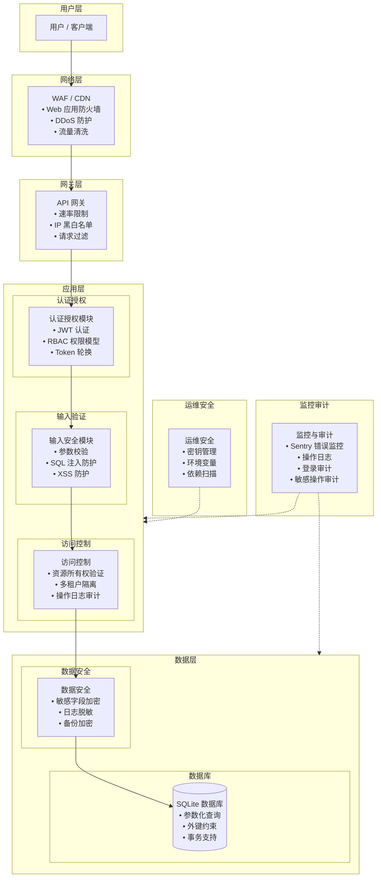
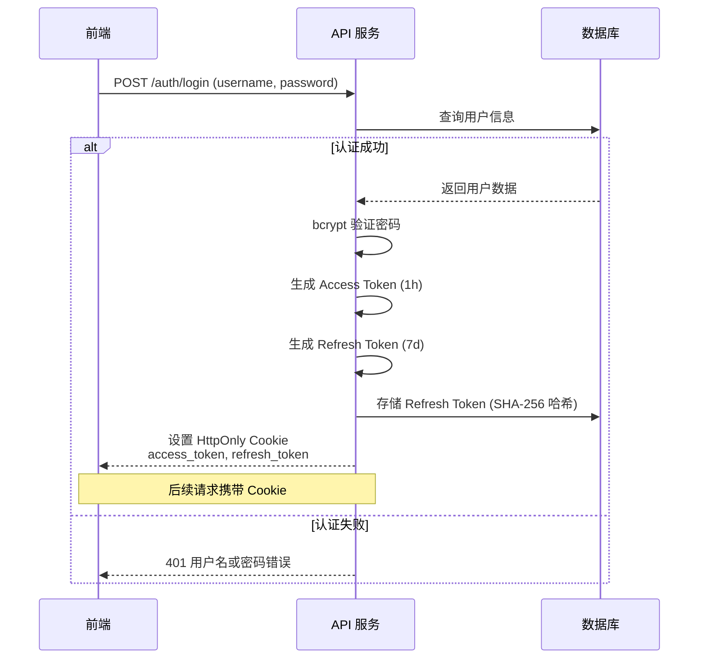
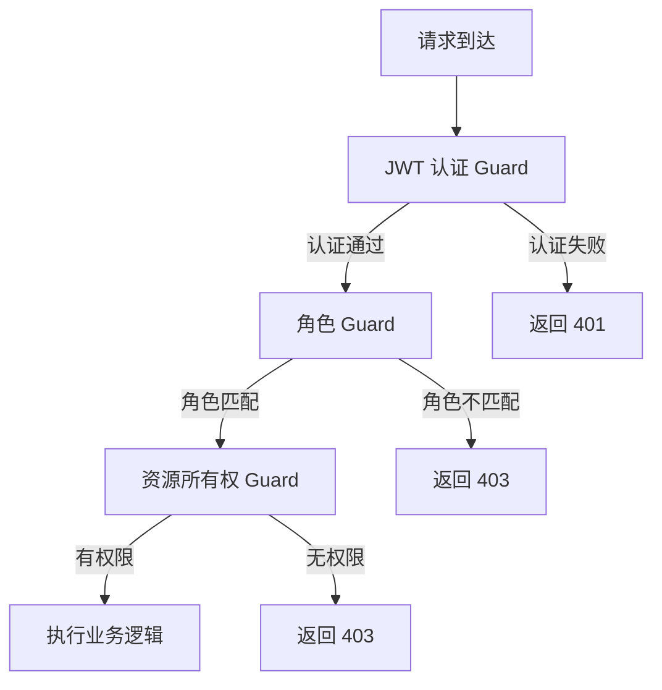
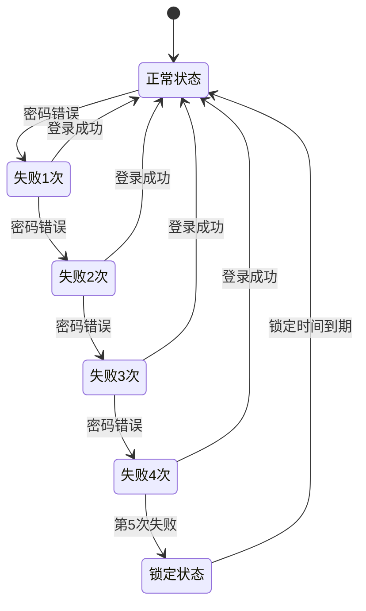

# 安全架构总览文档

## 1. 安全架构总览图

本系统采用分层安全架构，从网络层到数据层逐层设防，确保系统全方位安全。



### 1.1 安全设计原则

- **纵深防御**：多层安全防护，单层被突破不影响整体安全
- **最小权限**：用户/服务只授予完成任务所需的最少权限
- **默认安全**：安全选项默认开启，而非可选配置
- **审计追踪**：所有敏感操作都有日志记录，可追溯
- **数据最小化**：只收集必要的数据，敏感数据加密存储
- **失败安全**：系统故障时默认拒绝访问，而非默认允许

---

## 2. 认证与授权

### 2.1 JWT 认证机制

系统使用 JWT (JSON Web Token) 进行无状态认证，结合 Refresh Token 实现安全的会话管理。

#### 认证流程



#### Token 结构

| 组成部分 | 说明 |
|---------|------|
| **Header** | 算法：HS256，类型：JWT |
| **Payload** | `sub` - 用户ID，`username` - 用户名，`role` - 角色，`tv` - Token版本，`cid` - 诊所ID，`iss` - 签发者，`aud` - 受众 |
| **Signature** | 使用 JWT_SECRET 签名 |

#### 关键安全特性

- **双 Token 机制**：Access Token（短有效期 1h）+ Refresh Token（长有效期 7d）
- **HttpOnly Cookie**：Token 存储在 HttpOnly Cookie 中，防止 XSS 窃取
- **Token 版本控制**：`tokenVersion` 机制，修改密码/登出时递增版本号，使所有旧 Token 失效
- **Refresh Token 轮换**：每次刷新都生成新的 Refresh Token，旧的立即失效
- **重放检测**：检测到 Refresh Token 被复用时，立即吊销该用户所有 Token

### 2.2 RBAC 权限模型

系统采用基于角色的访问控制（Role-Based Access Control）。

#### 角色定义

| 角色 | 角色代码 | 权限等级 | 说明 |
|------|---------|---------|------|
| 老板 | `BOSS` | 3 | 最高权限，可管理所有功能和用户 |
| 医生 | `DOCTOR` | 2 | 临床操作、患者管理、病历书写 |
| 前台 | `RECEPTIONIST` | 1 | 预约挂号、收费、患者建档 |

#### 权限验证流程



#### 权限控制实现

- **角色装饰器**：`@Roles(Role.BOSS, Role.DOCTOR)` 声明接口所需角色
- **角色守卫**：`RolesGuard` 校验用户角色是否在允许列表中
- **公开接口**：`@Public()` 装饰器标记无需认证的接口

### 2.3 多租户数据隔离

系统支持多诊所（多租户）部署，确保各诊所数据完全隔离。

#### 隔离机制

| 层级 | 实现方式 | 说明 |
|------|---------|------|
| **数据层** | `clinicId` 字段过滤 | 所有业务表都有 `clinicId` 字段，查询时自动过滤 |
| **服务层** | `ClinicContextService` | 从 JWT 中提取 clinicId，注入到请求上下文中 |
| **拦截器** | `ClinicContextInterceptor` | 自动将 clinicId 附加到创建/更新操作 |
| **数据库** | 单库多租户 | 共享数据库实例，通过 clinicId 逻辑隔离 |

#### 关键保障

- 所有查询默认带上 `clinicId` 过滤条件
- 越权访问其他诊所数据时返回 403 错误
- 审计日志记录操作所属诊所，便于问题追踪

### 2.4 资源所有权验证

对于敏感资源，系统提供资源所有权验证机制，确保用户只能操作自己有权限的资源。

#### 验证方式

- **装饰器声明**：`@ResourceOwner('patientId')` 声明资源 ID 参数位置
- **守卫检查**：`ResourceOwnerGuard` 验证资源的 clinicId 是否与当前用户匹配
- **自定义校验**：复杂场景可自定义所有权校验逻辑

---

## 3. 输入安全

### 3.1 参数验证（class-validator）

系统使用 `class-validator` 进行声明式参数校验，确保输入数据的合法性。

#### 验证层级

| 层级 | 技术 | 说明 |
|------|------|------|
| **DTO 层** | class-validator 装饰器 | 在 DTO 类上声明校验规则 |
| **Pipe 层** | NestJS ValidationPipe | 自动校验并返回结构化错误 |
| **业务层** | 业务逻辑校验 | 复杂业务规则的额外校验 |

#### 常用校验规则

```typescript
// 示例：患者创建 DTO
export class CreatePatientDto {
  @IsNotEmpty({ message: '姓名不能为空' })
  @MaxLength(50, { message: '姓名不能超过50个字符' })
  name: string;

  @IsNotEmpty({ message: '手机号不能为空' })
  @Matches(/^1[3-9]\d{9}$/, { message: '手机号格式不正确' })
  phone: string;

  @IsEnum(Gender, { message: '性别值不正确' })
  gender: Gender;
}
```

### 3.2 SQL 注入防护

系统通过多层防护机制防止 SQL 注入攻击。

#### 防护措施

| 防护层 | 实现方式 | 说明 |
|--------|---------|------|
| **参数化查询** | 预编译语句 + 参数绑定 | 所有 SQL 操作使用 prepare + 参数，禁止字符串拼接 |
| **SQL 注入中间件** | `SqlInjectionMiddleware` | 扫描请求参数/Body 中的 SQL 关键字和模式 |
| **输入验证** | class-validator | 严格校验输入格式，限制特殊字符 |
| **列名校验** | `validateColumnName` | 动态排序/筛选时验证列名合法性 |

#### SQL 注入中间件检测规则

- **关键字检测**：`select from`, `drop table`, `union select` 等 SQL 短语
- **模式匹配**：`OR '1'='1'`, `AND 1=1`, `xp_xxx`, `sp_xxx` 等注入模式
- **排除路径**：文档接口（含 SQL 示例）、refresh token 接口（随机字符串）

### 3.3 XSS 防护

系统通过输入净化和输出编码防止跨站脚本攻击。

#### 防护措施

| 防护点 | 实现方式 | 说明 |
|--------|---------|------|
| **输入净化** | `sanitize-html` / `sanitizePlain` | 富文本内容过滤危险标签，纯文本转义 |
| **输出编码** | 前端框架自动编码 | React/Vue 等框架默认对插值进行 HTML 转义 |
| **Content-Security-Policy** | HTTP 响应头 | 限制脚本加载来源（部署层配置） |
| **HttpOnly Cookie** | Token 存储方式 | 防止 XSS 窃取 Token |

#### 净化工具

- `sanitizePlain(text)`：净化纯文本，移除/转义危险字符
- `sanitizeHtml(html)`：净化富文本，保留安全标签，移除危险标签和属性

### 3.4 请求大小限制

系统限制请求体大小，防止 DoS 攻击。

| 限制项 | 默认值 | 说明 |
|--------|-------|------|
| JSON 请求体 | 100KB | `express.json({ limit: '100kb' })` |
| URL 编码表单 | 100KB | `express.urlencoded({ limit: '100kb' })` |
| 文件上传 | 按业务配置 | 各文件上传接口单独配置 |

---

## 4. 数据安全

### 4.1 敏感字段加密

系统对身份证号等高度敏感字段进行 AES-256-GCM 加密存储。

#### 加密算法

| 参数 | 值 | 说明 |
|------|-----|------|
| **算法** | AES-256-GCM | 对称加密，带认证标签 |
| **密钥长度** | 256 位 | 32 字节密钥 |
| **IV 长度** | 12 字节 | GCM 推荐 IV 长度 |
| **认证标签** | 16 字节 | 用于完整性校验 |
| **存储格式** | `iv:authTag:ciphertext` | 三部分均为 hex 编码 |

#### 密钥管理

- **密钥来源**：环境变量 `ENCRYPTION_KEY`（64 位 hex 字符串）
- **密钥生成**：首次启动未配置时自动生成并提示配置
- **密钥轮换**：支持 legacy key 配置，解密时自动尝试新旧密钥
- **备份密钥**：备份文件使用相同密钥加密

#### 加密字段清单

| 字段 | 表名 | 加密方式 | 列表展示 |
|------|------|---------|---------|
| `idCard` | Patient | AES-256-GCM | 脱敏显示（110101********1234） |
| 备份文件 | - | AES-256-GCM | - |

### 4.2 日志脱敏

系统对日志中的敏感信息进行脱敏处理，防止敏感数据泄露。

#### 脱敏规则

| 数据类型 | 脱敏方式 | 示例 |
|---------|---------|------|
| 手机号 | 前 3 后 4，中间 4 位用 * | `138****8000` |
| 身份证号 | 前 6 后 4，中间 8 位用 * | `110101********1234` |
| 邮箱 | 前 2 位 + *** + 域名 | `zh***@example.com` |
| 姓名 | 保留首字，其余用 * | `张*` |

#### 脱敏应用场景

- API 响应中的患者列表（手机号、身份证号）
- 错误日志中的请求参数
- 操作日志中的变更内容
- 审计日志中的敏感数据

### 4.3 备份加密

数据库备份文件使用 AES-256-GCM 加密存储。

#### 备份文件格式

```
┌──────────┬─────────┬───────┬──────────┬──────────────┐
│ Magic(4B)│ Version │ IV    │ AuthTag  │ Ciphertext   │
│ "DBAK"   │ (1B)    │ (12B) │ (16B)    │ (可变长度)   │
└──────────┴─────────┴───────┴──────────┴──────────────┘
```

#### 安全特性

- 加密前压缩，减少存储体积
- 带认证标签，确保备份完整性
- 与业务数据使用同一密钥，便于管理

---

## 5. 访问控制

### 5.1 速率限制（滑动窗口）

系统实现了基于滑动窗口的速率限制，防止暴力破解和接口滥用。

#### 限流策略

| 限流类型 | 阈值 | 时间窗口 | 说明 |
|---------|------|---------|------|
| **登录接口（IP）** | 10 次 | 5 分钟 | 防止暴力破解密码 |
| **登录接口（用户名）** | 5 次 | 5 分钟 | 针对特定账号的爆破防护 |
| **刷新 Token** | 10 次 | 1 分钟 | 防止 Refresh Token 暴力枚举 |
| **普通接口（BOSS）** | 300 次/分钟 | 1 分钟 | 老板角色较高阈值 |
| **普通接口（医生）** | 200 次/分钟 | 1 分钟 | 医生角色标准阈值 |
| **普通接口（前台）** | 150 次/分钟 | 1 分钟 | 前台角色标准阈值 |
| **未认证用户** | 120 次/分钟 | 1 分钟 | 匿名用户默认阈值 |

#### 实现方式

- **中间件**：`RateLimitMiddleware` 全局限流
- **存储**：内存 Map（单实例部署），多实例需迁移到 Redis
- **滑动窗口**：记录每次请求时间戳，窗口内计数
- **响应头**：返回 `X-RateLimit-Limit`、`X-RateLimit-Remaining`、`X-RateLimit-Reset`
- **超限响应**：429 状态码 + `Retry-After` 头

### 5.2 登录失败锁定

系统对连续登录失败的账号进行临时锁定。

#### 锁定策略

| 参数 | 值 | 说明 |
|------|-----|------|
| 最大尝试次数 | 5 次 | `LOGIN_MAX_ATTEMPTS` |
| 锁定时长 | 30 分钟 | `LOGIN_LOCK_DURATION_MS` |
| 计数重置 | 登录成功后清零 | 成功登录重置 `loginAttempts` |

#### 锁定流程



### 5.3 IP 白名单/黑名单

系统支持 IP 访问控制（部署层实现）。

| 控制方式 | 说明 | 实现位置 |
|---------|------|---------|
| IP 白名单 | 仅允许白名单 IP 访问管理后台 | Nginx / WAF 层 |
| IP 黑名单 | 阻止恶意 IP 访问 | Nginx / WAF 层 |
| 动态封禁 | 检测到攻击自动加入黑名单 | WAF / 安全网关 |

---

## 6. 审计与监控

### 6.1 操作日志

系统记录所有重要业务操作的变更历史，支持追溯和审计。

#### 日志内容

| 字段 | 说明 |
|------|------|
| `id` | 日志 ID |
| `type` | 操作类型（CREATE/UPDATE/DELETE 等） |
| `targetId` | 操作目标 ID |
| `targetType` | 操作目标类型（Patient/Charge/User 等） |
| `beforeData` | 变更前数据（JSON） |
| `afterData` | 变更后数据（JSON） |
| `operatorId` | 操作人 ID |
| `clinicId` | 所属诊所 |
| `createdAt` | 操作时间 |

#### 记录方式

- **装饰器声明**：`@OperationLogResource('患者')` 标记资源类型
- **拦截器记录**：`GlobalOperationLogInterceptor` 自动捕获变更并记录
- **手动记录**：复杂场景在业务代码中手动调用审计服务

### 6.2 登录审计

系统记录所有登录/登出事件，用于安全审计。

#### 审计事件

| 事件类型 | 说明 | 记录内容 |
|---------|------|---------|
| `LOGIN` | 用户登录 | 用户名、登录时间、IP |
| `LOGOUT` | 用户登出 | 用户 ID、登出时间 |
| `PASSWORD_CHANGE` | 密码修改 | 用户 ID、修改时间 |

### 6.3 敏感操作审计

对于获取完整敏感数据的操作，系统单独记录审计日志。

| 操作 | 说明 | 触发场景 |
|------|------|---------|
| `PHONE_ACCESS` | 获取完整手机号 | 发送短信前需要完整手机号 |
| `ID_CARD_ACCESS` | 获取完整身份证号 | 打印处方等场景 |

#### 审计字段

- `operatorId` - 操作人
- `targetId` - 目标患者
- `remark` - 操作说明
- `ip` - 操作 IP
- `userAgent` - 客户端信息
- `source` - 操作来源

### 6.4 错误监控

系统集成 Sentry 进行错误监控和告警。

#### 监控内容

- 未捕获的异常
- 数据库错误
- 性能问题
- 用户行为异常

#### 上报内容

- 错误堆栈
- `traceId` 请求追踪 ID
- 请求方法和 URL
- 状态码和错误码

---

## 7. 运维安全

### 7.1 密钥管理

系统密钥通过环境变量管理，不硬编码在代码中。

#### 密钥清单

| 密钥变量名 | 用途 | 长度要求 |
|-----------|------|---------|
| `JWT_SECRET` | JWT 签名密钥 | 至少 32 字符，推荐 64 字符随机字符串 |
| `ENCRYPTION_KEY` | 敏感字段加密密钥 | 64 字符 hex（32 字节） |
| 数据库密码 | 数据库连接 | 按数据库要求 |

#### 最佳实践

- 密钥使用密码学安全的随机数生成
- 不同环境（开发/测试/生产）使用不同密钥
- 定期轮换密钥（支持 legacy key 平滑过渡）
- 密钥备份存储在安全的密码管理器中
- 禁止将密钥提交到版本控制系统

### 7.2 环境变量管理

所有配置通过环境变量注入，便于不同环境部署。

#### 配置文件

- `.env.example` - 环境变量示例模板（提交到代码库）
- `.env` - 实际环境配置（不提交到代码库，已加入 .gitignore）

#### 配置校验

系统启动时校验关键配置的完整性和格式：
- `ConfigValidationService` 配置校验服务
- 缺失必要配置时启动失败并给出明确提示

### 7.3 依赖安全扫描

#### 扫描工具

| 工具 | 用途 | 频率 |
|------|------|------|
| `npm audit` | 检测 npm 依赖漏洞 | 每次安装依赖时 |
| 依赖锁定 | `package-lock.json` 确保版本一致 | 持续 |

#### 依赖更新策略

- 定期更新依赖到最新稳定版
- 重大版本更新前进行充分测试
- 关注安全公告，及时修复高危漏洞

---

## 8. 安全检查清单

### 8.1 开发阶段

- [ ] 所有用户输入都经过校验（class-validator）
- [ ] SQL 查询使用参数化，禁止字符串拼接
- [ ] 敏感字段使用加密存储
- [ ] 输出数据中的敏感信息已脱敏
- [ ] 接口声明了正确的角色权限
- [ ] 越权访问会返回 403 错误
- [ ] 密码使用 bcrypt 哈希存储（salt rounds >= 10）
- [ ] 不将密钥/密码硬编码在代码中

### 8.2 测试阶段

- [ ] SQL 注入测试已通过
- [ ] XSS 防护测试已通过
- [ ] 越权访问测试已通过
- [ ] 速率限制测试已通过
- [ ] Token 过期/吊销测试已通过
- [ ] 登录锁定测试已通过
- [ ] 敏感数据脱敏验证已通过

### 8.3 部署阶段

- [ ] 使用 HTTPS，配置 TLS 证书
- [ ] 配置 WAF / CDN
- [ ] 环境变量正确配置，密钥强度足够
- [ ] 数据库文件权限受限（仅服务进程可读写）
- [ ] 备份文件已加密
- [ ] 日志中不包含敏感数据
- [ ] 错误页面不暴露堆栈信息（生产环境）
- [ ] 配置安全响应头（CSP, X-Frame-Options 等）

### 8.4 运维阶段

- [ ] 定期轮换密钥
- [ ] 定期更新依赖和系统补丁
- [ ] 定期审查操作日志和审计日志
- [ ] 监控异常登录和访问行为
- [ ] 定期备份并验证备份可用性
- [ ] 制定安全事件响应预案

---

## 9. 相关文件

| 文件路径 | 说明 |
|---------|------|
| `src/common/middleware/sql-injection.middleware.ts` | SQL 注入防护中间件 |
| `src/common/middleware/rate-limit.middleware.ts` | 速率限制中间件 |
| `src/common/guards/roles.guard.ts` | 角色权限守卫 |
| `src/common/guards/resource-owner.guard.ts` | 资源所有权守卫 |
| `src/common/utils/security/encryption.ts` | 加密工具函数 |
| `src/common/utils/security/mask.ts` | 脱敏工具函数 |
| `src/common/utils/security/sanitize.ts` | 输入净化工具 |
| `src/modules/auth/jwt.strategy.ts` | JWT 认证策略 |
| `src/modules/auth/auth.service.ts` | 认证服务 |
| `src/common/filters/all-exceptions.filter.ts` | 全局异常过滤器 |
