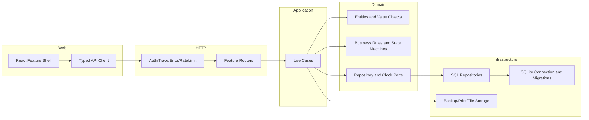
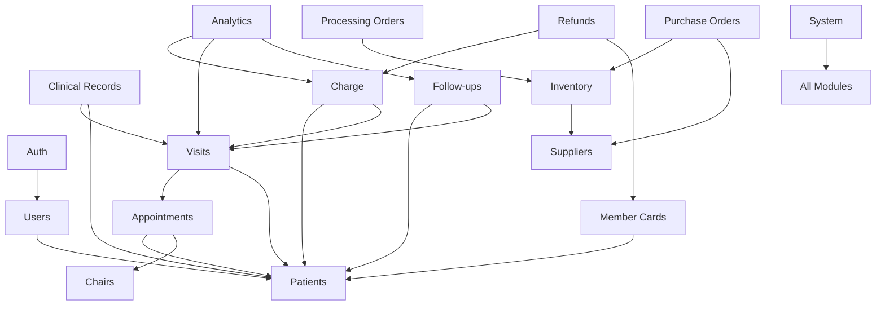
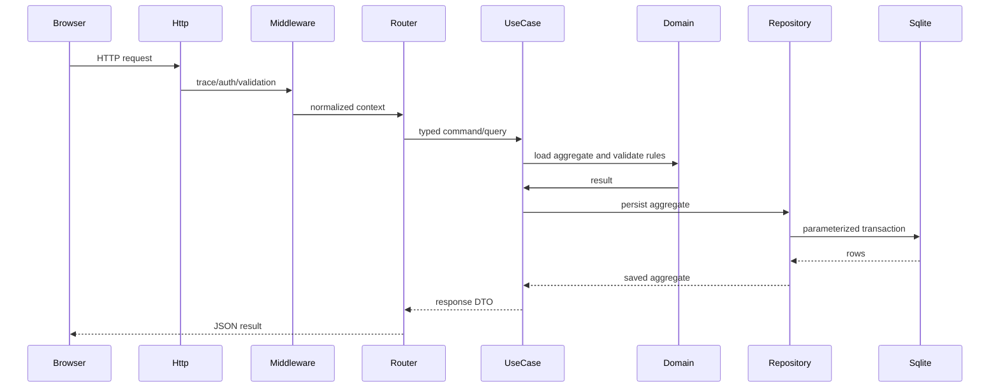

# Refactor V2 - System Architecture

## Goals

- Replace the legacy controller-service-schema code organization with a clean modular monolith.
- Keep the business rules independent from Express/SQLite/React.
- Make every module self-contained: domain contract, application use case, infrastructure repository, HTTP adapter, web feature.
- Use typed events for side effects instead of hidden service-to-service calls.
- Make the API surface data-driven and consistent while retaining custom endpoints for complex workflows.
- Target the Electron desktop app as the primary runtime. The React renderer is the Electron window, not a separately deployed public web application.

## Architecture Layers



## Module Dependency Graph



## Request Data Flow



## New Project Layout

```text
apps/v2/
  src/
    domain/          Entities, enums, value objects, repository ports
    server/
      application/   Use cases, commands, queries, service modules
      infrastructure/ SQLite, repositories, file/backup adapters
      http/          Express app, middleware, feature routers, DTO validation
      electron/      Electron main-process modules (watchdog, secrets, api-process)
    shared/          Shared utilities (csv, html, log/redact)
    web/             Vite React application
```

## Key Decisions

1. **Modular monolith**: one deployable backend, clear module boundaries, no hidden cross-module service calls.
2. **Hexagonal ports**: use cases depend on interfaces, not SQL or Express.
3. **Type-first contracts**: a single domain package defines entities, enums, commands, queries, and DTOs.
4. **Direct side-effect wiring**: audit logs, alerts, search index and sync
   changes are invoked by services directly; an event bus can be introduced
   later if fan-out grows.
5. **Data-driven CRUD**: simple resources share a generic router and repository; complex workflows get explicit use cases.
6. **Soft delete and idempotency are infrastructure invariants**, not per-module conventions.
7. **Fixed timezone**: all business dates are normalized to `Asia/Shanghai`.
8. **Money is integer cents** until the presentation layer formats it.
