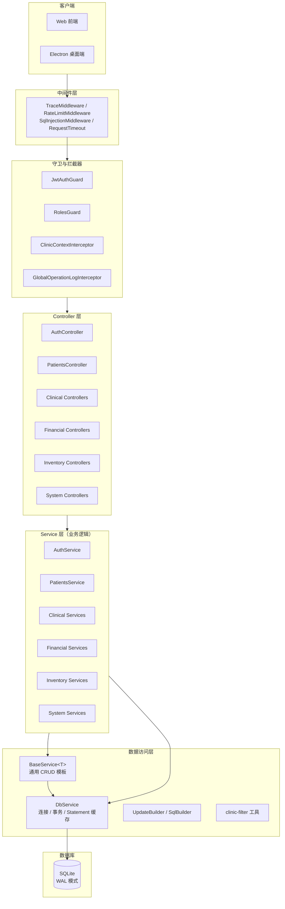
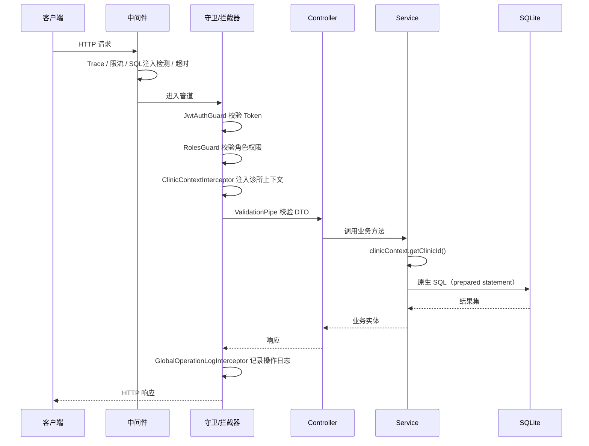

# 系统架构总览

## 1. 项目概述

口腔诊所管理系统 API 是一套基于 NestJS 构建的 RESTful 后端服务，用于支撑口腔诊所的日常运营，涵盖患者管理、临床诊疗、财务收费、库存管理、系统配置等业务领域。

系统以 Electron 桌面应用形式分发，每个诊所终端运行独立的 API 实例，数据存储在本地 SQLite 数据库中。API 同时也可独立部署为服务端架构（已有云部署与数据库迁移计划）。

## 2. 技术栈

| 类别 | 技术 | 说明 |
|------|------|------|
| 运行时 | Node.js + TypeScript | 强类型保障医疗数据准确性 |
| 框架 | NestJS 11 | 模块化架构、依赖注入、装饰器路由 |
| 数据库 | SQLite (better-sqlite3) | 嵌入式单文件数据库，同步 API |
| 认证 | JWT + Refresh Token | 无状态认证，bcrypt 密码哈希 |
| 数据访问 | 原生 SQL（无 ORM） | BaseService 通用 CRUD + DbService 连接管理 |
| 验证 | class-validator + class-transformer | DTO 入参校验与转换 |
| API 文档 | Swagger (OpenAPI) | 开发环境自动生成 |
| 安全 | helmet + sanitize-html + 限流 + SQL 注入检测 | 多层安全防护 |
| 监控 | Sentry | 错误追踪（可选） |
| 测试 | Jest + Supertest + fast-check | 多层级测试体系 |

## 3. 分层架构



### 请求处理流程



## 4. 模块划分

系统按业务领域划分为 10 个顶层模块，全部在 `AppModule` 中注册：

| 模块 | 职责 | 关键子模块 |
|------|------|-----------|
| **AuthModule** | 认证与用户管理 | 登录、刷新、登出、改密、用户 CRUD |
| **PatientsModule** | 患者档案管理 | 患者信息、标签、过敏史、家族关系 |
| **ClinicalModule** | 临床诊疗业务 | 初诊、口腔检查、牙周记录、就诊、治疗、治疗计划、挂号分诊 |
| **SchedulingModule** | 预约排班 | 预约管理、牙椅管理 |
| **FinancialModule** | 财务收费 | 收费、支付、退费、欠款、会员卡、套餐 |
| **InventoryModule** | 库存仓储 | 库存项、采购单、加工单、供应商 |
| **ContentModule** | 临床内容 | 影像、处方、牙位记录、药品目录 |
| **CommunicationModule** | 沟通随访 | 随访管理、微信通知 |
| **SystemModule** | 系统管理 | 诊所、设置、统计、操作日志、健康检查、搜索 |
| **EquipmentModule** | 设备管理 | 设备信息维护 |

## 5. 核心设计原则

### 多租户隔离
- 每个用户属于一个诊所（`clinicId`），诊所间数据完全隔离
- 通过 `ClinicContextService`（基于 AsyncLocalStorage）在请求生命周期内传递 `clinicId`
- 所有数据查询强制使用 `buildClinicFilter` 添加 `WHERE clinicId = ?`
- 详见 [ADR-0002](../adr/0002-clinic-isolation-via-context.md)

### 软删除
- 业务表均含 `deletedAt` 字段，删除操作默认置位 `deletedAt` 而非物理删除
- `BaseService.softDelete` 自动处理级联软删除、唯一字段加后缀避免冲突、审计日志
- 查询默认排除 `deletedAt IS NOT NULL` 的记录

### 审计日志
- 所有写操作（创建/更新/删除/登录等）写入 `AuditLog` 表
- `BaseService.logAudit` 提供统一审计方法，记录 beforeData/afterData
- `GlobalOperationLogInterceptor` 在拦截器层自动记录操作日志

### 幂等性
- 关键写操作（收费、退费、库存调整）支持幂等键
- `IdempotencyService`（全局单例）防止重复提交导致重复扣款
- 详见 [ADR-0005](../adr/0005-idempotency-service-single-instance.md)

## 6. 公共服务

| 服务 | 文件 | 职责 |
|------|------|------|
| **DbService** | `src/db/db.service.ts` | SQLite 连接管理、prepared statement 缓存（LRU 100）、事务（`BEGIN IMMEDIATE`）、慢查询日志、WAL checkpoint |
| **BaseService&lt;T&gt;** | `src/common/services/base.service.ts` | 通用 CRUD 基类，自动处理 clinicId 注入、软删除、JSON 序列化、金额转换、XSS 清洗、审计日志、唯一约束重试、游标分页 |
| **ClinicContextService** | `src/common/services/clinic-context.service.ts` | 基于 AsyncLocalStorage 的诊所上下文，请求级隔离 |
| **CacheService** | `src/common/services/cache.service.ts` | 全局缓存单例，支持 TTL、模式匹配失效、命中率统计（详见 [ADR-0001](../adr/0001-global-cache-service.md)） |
| **IdempotencyService** | `src/common/services/idempotency.service.ts` | 幂等键管理，防止重复提交 |
| **AppLogger** | `src/common/services/logger.service.ts` | 结构化日志，缓冲写入，敏感字段脱敏 |
| **ConfigValidationService** | `src/common/services/config-validation.service.ts` | 启动时校验 JWT_SECRET / ENCRYPTION_KEY 等关键配置 |

## 7. 目录结构

```
apps/api/
├── src/
│   ├── main.ts                      # 应用入口（Swagger / Helmet / CORS / 优雅关闭）
│   ├── app.module.ts                # 根模块（注册所有业务模块 + 全局守卫/拦截器）
│   ├── bootstrap/                   # 启动期一次性任务（加密迁移等）
│   ├── cli/                         # 命令行工具（重置密码等）
│   ├── config/
│   │   └── constants.ts             # 应用级配置常量（端口/超时/阈值）
│   ├── common/                      # 公共层
│   │   ├── constants/               # 常量（缓存键/角色/表名/分页）
│   │   ├── decorators/              # 装饰器（@CurrentUser/@Roles/@Public/@OperationLog）
│   │   ├── domain/                  # 领域原语（Money/Result）
│   │   ├── dto/                     # 公共 DTO（分页）
│   │   ├── errors/                  # 错误码与业务异常
│   │   ├── filters/                 # 全局异常过滤器
│   │   ├── guards/                  # 角色守卫
│   │   ├── interceptors/            # 拦截器（诊所上下文/TraceId/操作日志）
│   │   ├── middleware/              # 中间件（限流/超时/SQL注入/Trace）
│   │   ├── monitoring/              # Sentry 监控
│   │   ├── services/                # 公共服务（BaseService/Cache/ClinicContext/...）
│   │   ├── test-helpers/            # 测试工具（MockDb/并发测试/故障注入）
│   │   ├── types/                   # 类型定义（branded types）
│   │   └── utils/                   # 工具（db/format/security/infra）
│   ├── db/                          # 数据库层
│   │   ├── database.ts              # 连接创建/Pragma/备份/完整性检查
│   │   ├── db.service.ts            # DbService（连接/事务/Statement缓存）
│   │   ├── schema/                  # 建表语句（按业务域分文件）
│   │   ├── seed/                    # 种子数据（含工厂函数）
│   │   ├── migrations.ts            # 数据库迁移
│   │   └── paths.ts                 # 数据目录/数据库路径计算
│   └── modules/                     # 业务模块（按领域划分）
│       ├── auth/                    # 认证
│       ├── patients/                # 患者
│       ├── clinical/                # 临床（初诊/检查/就诊/治疗/计划/挂号）
│       ├── scheduling/              # 排班（预约/牙椅）
│       ├── financial/               # 财务（收费/退费/会员卡）
│       ├── inventory/               # 库存（库存/采购/加工/供应商）
│       ├── content/                 # 内容（影像/处方/牙位/药品）
│       ├── communication/           # 沟通（随访/微信）
│       ├── system/                  # 系统（诊所/设置/统计/日志/健康/搜索）
│       └── equipment/               # 设备
├── test/                            # E2E / 烟雾 / 迁移测试
├── scripts/                         # 代码健康/技术债务追踪脚本
├── .env.example                     # 环境变量示例
├── jest.config.js                   # 单元/集成测试配置
├── jest.smoke.config.js             # 烟雾测试配置
├── jest.migration.config.js         # 迁移测试配置
└── package.json
```

## 相关文档

- [ADR 索引](../adr/README.md) - 架构决策记录
- [ADR-0006: 数据库选型 - SQLite](../adr/0006-database-choice-sqlite.md)
- [ADR-0007: 数据访问层 - 原生 SQL](../adr/0007-native-sql-over-orm.md)
- [ADR-0008: 认证方案 - JWT](../adr/0008-jwt-authentication.md)
- [ADR-0009: 测试策略](../adr/0009-testing-strategy.md)
- [ADR-0010: 文件存储方案](../adr/0010-file-storage.md)
- [云部署计划](./cloud-deployment-plan.md)
- [数据库迁移计划](./database-migration-plan.md)
